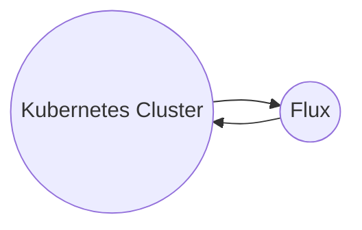

# Creating a New Environment
The following is a step-by-step guide to creating a new environment for the solution.

Unfortunately the solution is somewhat of a chicken and egg situation, certain elements of the IAC need to be updated into the flux configuration, and some elements from the flux configuration needs to be applied to the IAC script. We will try to remove these elements in due course to make it cleaner.

