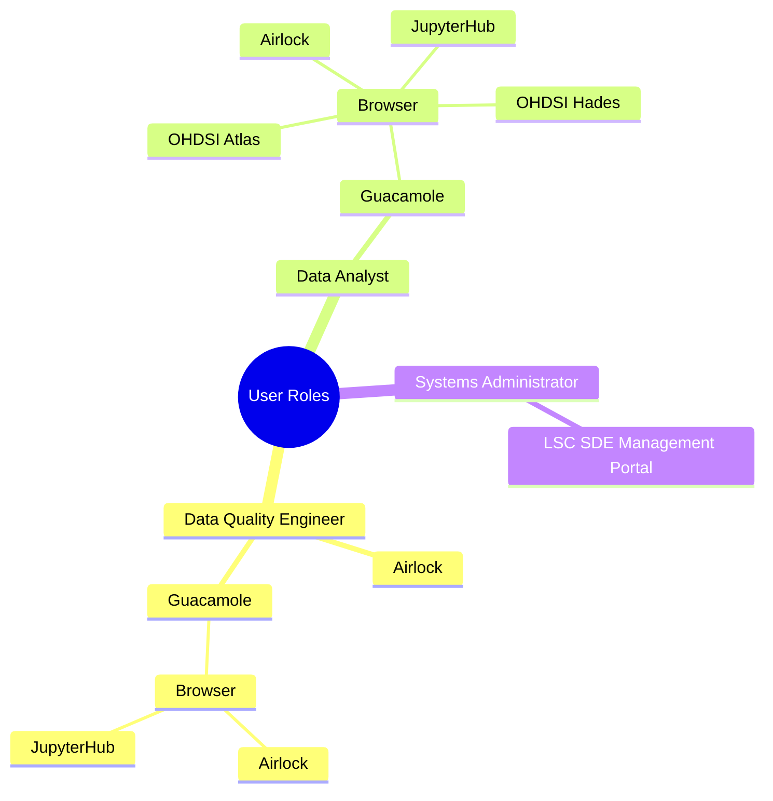
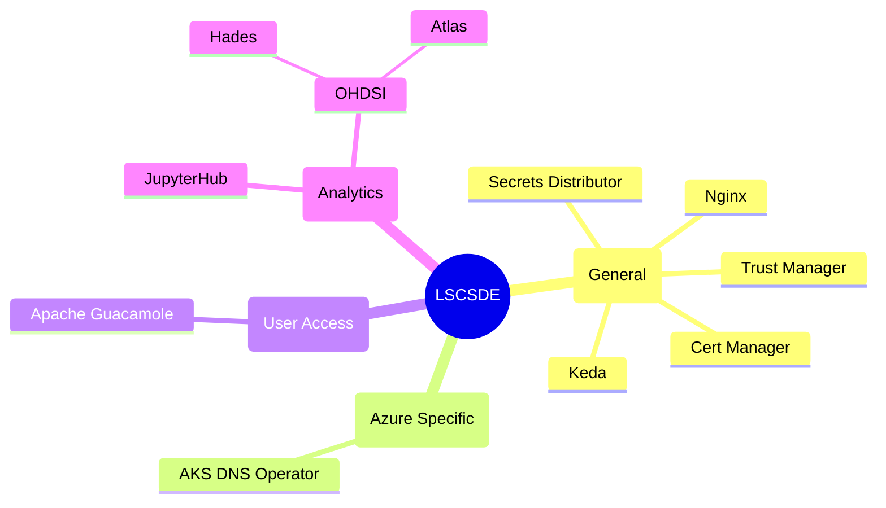

# Lancashire and South Cumbria Secure Data Environment
To checkout the repositories, run the following command in the integrated terminal:

## User Roles

## Components

### General Components
#### Secrets Distributor
The secrets distributor is responsible to copying secrets around kubernetes allowing them to be used in pod definitions in multiple namespaces, Further information can be found in the [Secrets Distributor](./docker/secrets-distributor/) repository

#### Cert Manager
[Cert Manager](https://cert-manager.io/) is a powerful and extensible X.509 certificate controller for Kubernetes and OpenShift workloads. It will obtain certificates from a variety of Issuers, both popular public Issuers as well as private Issuers, and ensure the certificates are valid and up-to-date, and will attempt to renew certificates at a configured time before expiry.

#### Trust Manager
[Trust Manager is part of the Cert Manager project](https://cert-manager.io/docs/trust/) but is designed to distribute trusted certificates to pods.

#### Nginx
[ingress-nginx is an Ingress controller for Kubernetes using NGINX as a reverse proxy and load balancer.](https://github.com/kubernetes/ingress-nginx).

#### Keda
[KEDA](https://keda.sh/) is a Kubernetes-based Event Driven Autoscaler. With KEDA, you can drive the scaling of any container in Kubernetes based on the number of events needing to be processed.

### User Access
#### Apache Guacamole
[Apache Guacamole](https://guacamole.apache.org/) is a clientless remote desktop gateway. It supports standard protocols like VNC, RDP, and SSH.

### Azure Specific Components
#### AKS DNS Operator
The AKS DNS Operator is a controller that manages Private DNZ Zone entries from kubernetes, allowing the system to adjust DNS entries just using annotations against service or ingress resources in kubernetes.

Further information can be found in the [AKS DNS Operator Image repository](./docker/aks-dns-operator/)

### Analytics
#### Jupyterhub
[JupyterHub](https://jupyter.org/hub) brings the power of notebooks to groups of users. It gives users access to computational environments and resources without burdening the users with installation and maintenance tasks. Users - including students, researchers, and data scientists - can get their work done in their own workspaces on shared resources which can be managed efficiently by system administrators.

The Lancashire and South Cumbria Secure Data Environment uses a [customised version of the Jupyter Hub container](https://github.com/lsc-sde/docker-jupyterhub) that allows us to integrate workspace management capabilities which are embedded into the kubernetes control plane. This is supported by a [management portal](https://github.com/lsc-sde/docker-analytics-workspace-mgmt) that allows us to manage workspaces and membership to those workspaces giving us the ability to customise workspaces to individual needs of the analysis teams.

#### OHDSI
[The Observational Health Data Sciences and Informatics](https://www.ohdsi.org/)  (or OHDSI, pronounced "Odyssey") program is a multi-stakeholder, interdisciplinary collaborative to bring out the value of health data through large-scale analytics. All our solutions are open-source.

##### Atlas
ATLAS is a free, publicly available, web-based tool developed by the OHDSI community that facilitates the design and execution of analyses on standardized, patient-level, observational data in the CDM forma

##### Hades
HADES (previously the OHDSI METHODS LIBRARY) is a collection of open-source R packages that offer functions which can be used together to perform a complete observational study, starting from data in the CDM, and resulting in estimates and supporting statistics, figures, and tables. 

## Important documents

* [Developers Starter Guide](./Developers.md)
* [New Environment Guide](./New-Environment.md)
* [Infrastructure](./iac/)