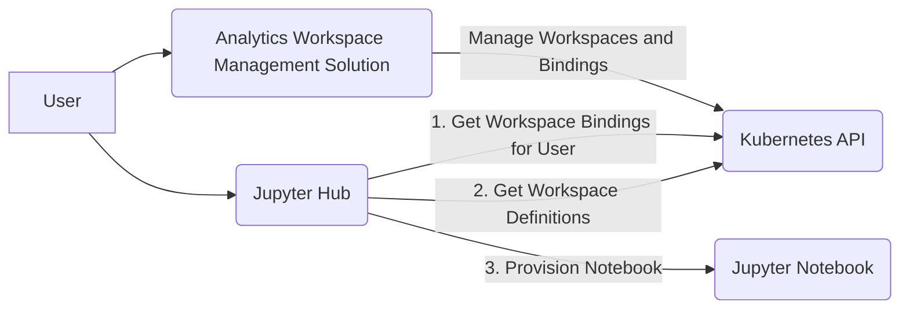

# Jupyter Hub Integration
The Lancashire and South Cumbria Secure Data Environment (LSC-SDE) [Analytics Workspace Management Solution](../Analytics-Workspace-Management-Solution.md) (AWMS) integrates with [JupyterHub](https://jupyter.org/hub) in order to allow easy management of Analytics workspaces in Jupyter Hub. 

## Development
* [Python Module - Workspace Management](https://github.com/lsc-sde/py-lscsde-workspace-mgmt)
* [Docker Image - Customised Jupyter Hub](https://github.com/lsc-sde/docker-jupyterhub)
