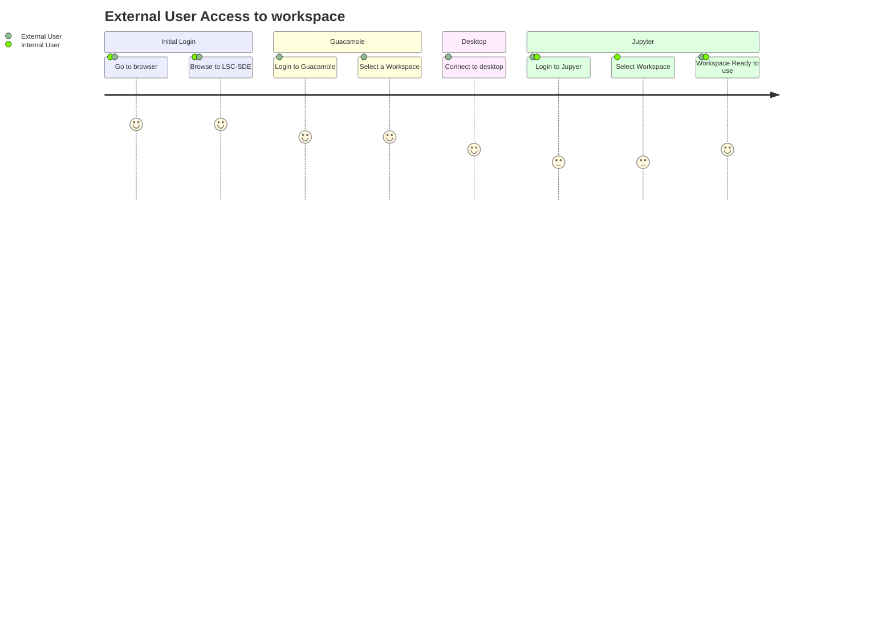
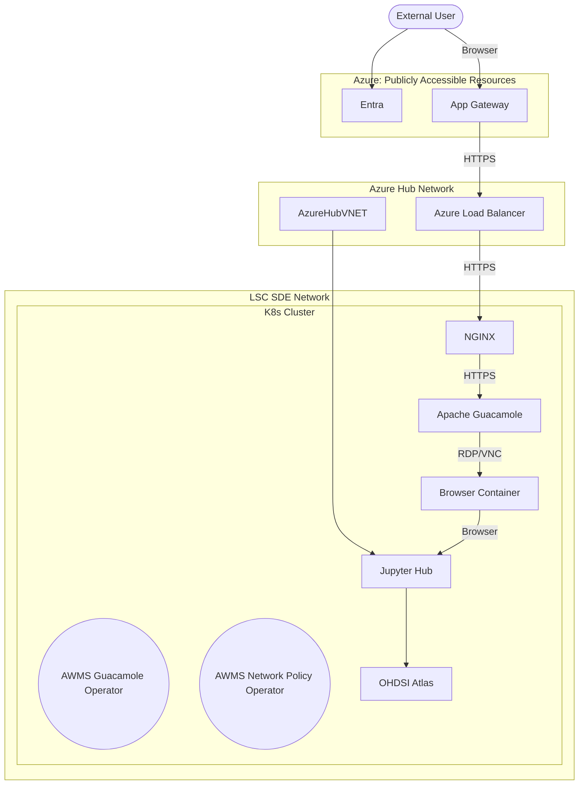

# External Access
As many of our research partners are universities and other organisations outside of the NHS it is likely that some of the users will not have a connection into the private network where the LSC SDE is hosted. As a result we need to provide secure access to the platform for external users.

## Requirements
The solution for external access must address the following requirements:
* Provide Secure Access to the environment for researchers
* Address the concerns of the majority of scenarios outlined in discussion #54
* Make the user journey as reasonably simple as possible for the user
* Apply appropriate roles based access controls

Options have been discussed in #55

## User Journey

## Components

### Workflow Components
#### Azure App Gateway Service
The Azure App Gateway service will be used as an application firewall and will expose the nginx service via the Azure Load balancer. This can be swapped out for another app firewall service.

#### Azure Load Balancer
The load balancer will expose the nginx service to the app gateway service. This can be swapped out for another load balancer service

#### [NGINX Ingress](./Components/Nginx.md)
The ingress NGINX service will act as a reverse proxy, forwarding traffic to Apache Guacamole.

#### [Apache Guacamole](./Components/Apache-Guacamole.md)
Apache Guacamole is the first application hit by external users, once logged in via an authentication / authorization service such as Azure Entra ID you are presented with a list of workspaces that you have access to. Once you select a workspace, Apache Guacamole will establish a VNC connection with the browser container provisioned for this user/workspace. From that browser container the user will then be able to access the relevant resources on the environment.  

It is even possible to configure Apache Guacamole to record user sessions so that they can be reviewed later.

We will customise the Apache Guacamole instance to call the kubernetes API to spin up the browser container if it is not already up and running and wait for the container to report it has started before opening a VNC connection to the container. This will add a few seconds to the connection but will mean that we can scale to zero when a container is not being used.

### Supporting Components
#### AWMS Guacamole Operator
The AWMS guacamole operator will watch for changes in Analytics Workspaces and Analytics Workspace Bindings, it will update the database with connection information for a user relevant to the workspaces they have access to.

When a binding is created or updated, the operator should update the guacamole database to create a connection to the browser container.

When a binding expires or is removed, the operator should detect that this has occurred and remove the relevant connections from the guacamole database.

In addition to this the Guacamole operator will monitor the database and when the VNC connection goes stale for a configurable amount of time, then guacamole will scale the container to zero.

#### AWMS Network Policy Operator
The AWMS Network Policy operator will watch for changes in  Analytics Workspaces and create network policies based on the definition of the workspace.

When a workspace is created, a network policy is generated based on the spec for the pods in that workspace.

When a workspace expires or is removed, the operator will detect this and remove the network policies relating to that workspace.

### Products
#### Jupyter Hub
Our custom image of Jupyter Hub will need to be adapted to identify the source of the request, if the user has come from a browser pod then it will only login the user to the workspace associated with that browser pod. 

## Improvements
The current model does not pass down credentials to the host server, so if the user needs access to other resources that are authenticated using Entra ID they will need to login again.

There are a number of options on how we can address this, with benefits and drawbacks.