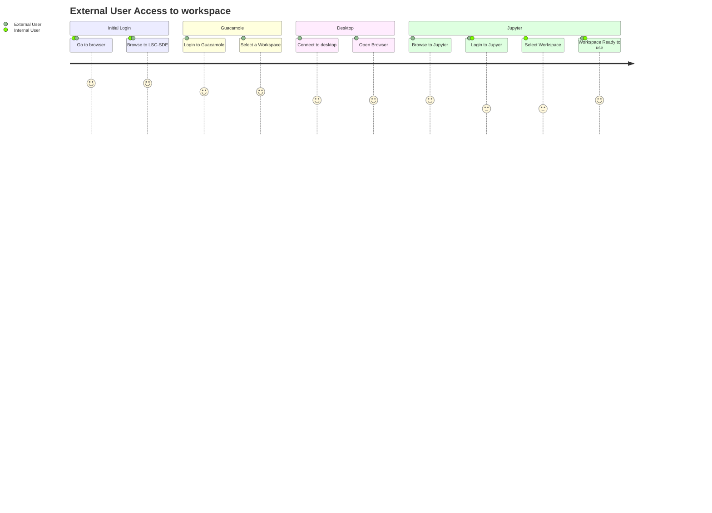
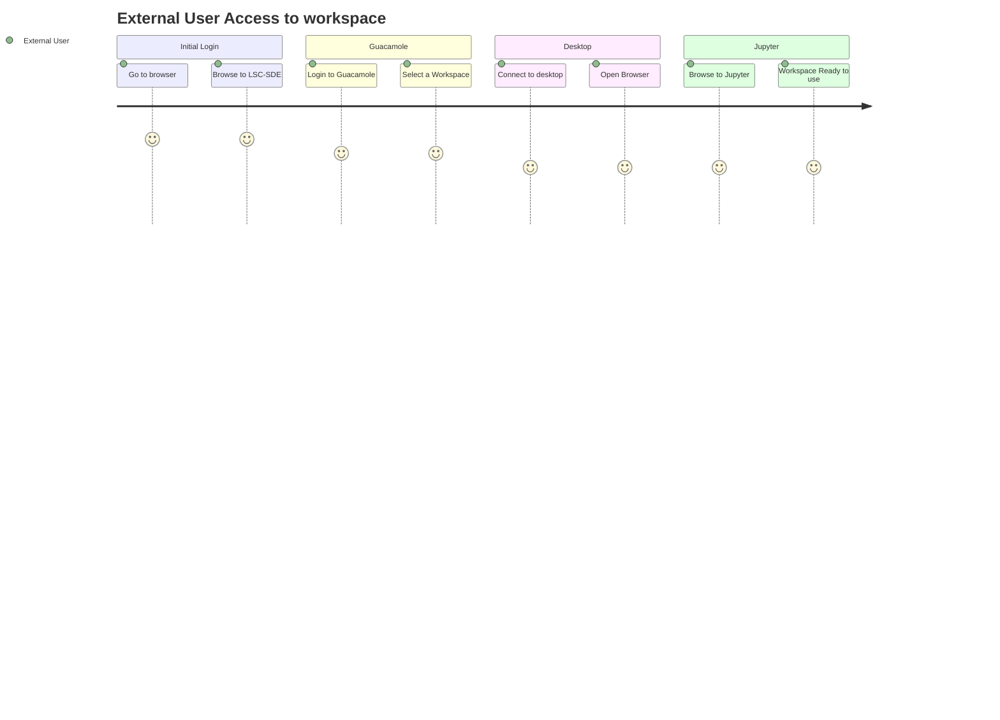

# External Access
As many of our research partners are universities and other organisations outside of the NHS it is likely that some of the users will not have a connection into the private network where the LSC SDE is hosted. As a result we need to provide secure access to the platform for external users.

## Requirements
The solution for external access must address the following requirements:
* Provide Secure Access to the environment for researchers
* Address the concerns of the majority of scenarios outlined in discussion #54
* Make the user journey as reasonably simple as possible for the user
* Apply appropriate roles based access controls

Options have been discussed in #55

## User Journey

## Components

### Workflow Components
#### Azure App Gateway Service
The Azure App Gateway service will be used as an application firewall and will expose the nginx service via the Azure Load balancer. This can be swapped out for another app firewall service.

#### Azure Load Balancer
The load balancer will expose the nginx service to the app gateway service. This can be swapped out for another load balancer service

#### [NGINX Ingress](./Components/Nginx.md)
The ingress NGINX service will act as a reverse proxy, forwarding traffic to Apache Guacamole.

#### [Apache Guacamole](./Components/Apache-Guacamole.md)
Apache Guacamole is the first application hit by external users, once logged in via an authentication / authorization service such as Azure Entra ID you are presented with a list of workspaces that you have access to. Once you select a workspace, Apache Guacamole will establish an RDP connection with the dev box related to the workspace in question. From that virtual machine the user will then be able to access the relevant resources on the environment.  

It is even possible to configure Apache Guacamole to record user sessions so that they can be reviewed later.

#### Azure Virtual Desktops
Azure Virtual Desktops will be used to provide the users access to the resources on their workspaces. Access to network resources will be limited via a proxy server.

#### [Squid Proxy](./Components/Squid.md) 
The Squid proxy is used by workspace virtual machines to access resources such as Jupyter hub. This allows us to control what the workspace virtual machine can access via kubernetes and calico network policies, allowing us to restrict the virtual machine to only be able to access the specific workspaces we want them to access.

### Supporting Components
#### AWMS Guacamole Operator
The AWMS guacamole operator will watch for changes in Analytics Workspaces and Analytics Workspace Bindings, it will update the database with connection information for a user relevant to the workspaces they have access to.

When a binding is created or updated, the operator should update the guacamole database to create a connection to the workspace server.

When a binding expires or is removed, the operator should detect that this has occurred and remove the relevant connections from the guacamole database. 

#### AWMS Proxy Operator
The AWMS proxy operator will watch for changes in Analytics Workspaces and provision a forward proxy based on the definition of the workspace. 

When a workspace is created, a proxy is provisioned for it within the working hours specified in the definition. The configuration for this proxy will be updated according to the sites allowed in the workspace definition.

When a workspace expires or is removed the operator will detect this and the proxy will be removed from the cluster.

#### AWMS Azure Operator
The AWMS Azure operator will watch for changes in Analytics Workspaces and provision a network and virtual machine based on the definition of the workspace. 

When a workspace is created, a virtual network and one or many virtual machines are provisioned based on the definition specified in the workspace and the virtual machine(s) will be started during the working hours specified in the workspace and stopped at the end of the working hours specified in the workspace.

When a workspace expires or is removed the operator will detect this and the virtual machine will be shutdown (if running). After a time it will backup the server and delete the virtual machines and virtual network for the workspace

When a workspace binding is created a user is created on the virtual machine and a password generated at random, this password will be stored in a secret in kubernetes and will be picked up by the AWMS Guacamole Operator when the connections are created. If the user exists already then the password will be updated and the account will be enabled (assuming the binding hasn't expired already).

When a workspace binding expires or is removed, the user associated on the virtual machine will be disabled.

#### AWMS Network Policy Operator
The AWMS Network Policy operator will watch for changes in  Analytics Workspaces and create network policies based on the definition of the workspace.

When a workspace is created, a network policy is generated based on the spec for the virtual machines and pods in that workspace.

When a workspace expires or is removed, the operator will detect this and remove the network policies relating to that workspace.

### Products
#### Jupyter Hub
Our custom image of Jupyter Hub will need to be adapted to identify the source of the request, if the user has come from a Workspace VM then it will only login the user to the workspace belonging to that workspace. 

#### OHDSI Atlas
If we can integrate Atlas into our Jupyter Notebooks then we can expose Atlas via jupyter hub, meaning that the user won't have to login again. 

## Improvements
The current model does not pass down credentials to the host server, so if the user needs access to other resources that are authenticated using Entra ID they will need to login again.

There are a number of options on how we can address this, with benefits and drawbacks.
