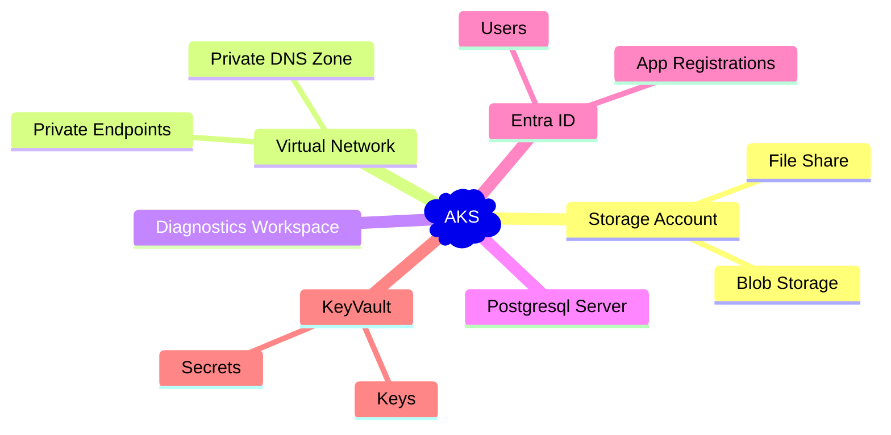

# Microsoft Azure
The Lancashire and South Cumbria Secure Data Environment leverages [Kubernetes](https://kubernetes.io/) on [Microsoft Azure](https://azure.microsoft.com/en-gb/products/kubernetes-service) to provide the Elasticity of the solution, it dynamically provisions additional nodes as required by individual workspaces. This allows us to quickly and easily dynamically provision compute, memory and GPU resource as is suitable for a specific resource project.

[Infrastructure in Azure is provisioned using terraform](https://github.com/lsc-sde/iac-terraform-azure)

## Components

* [Azure Kubernetes Service](./Microsoft-Azure/Azure-Kubernetes-Service.md)
* [Diagnostics Workspace](./Microsoft-Azure/Diagnostics-Workspace.md)
* [Entra ID](./Microsoft-Azure/Entra-ID.md)
* [Storage Account](./Microsoft-Azure/Storage-Accounts.md)
* [Virtual Network](./Microsoft-Azure/Virtual-Network.md)