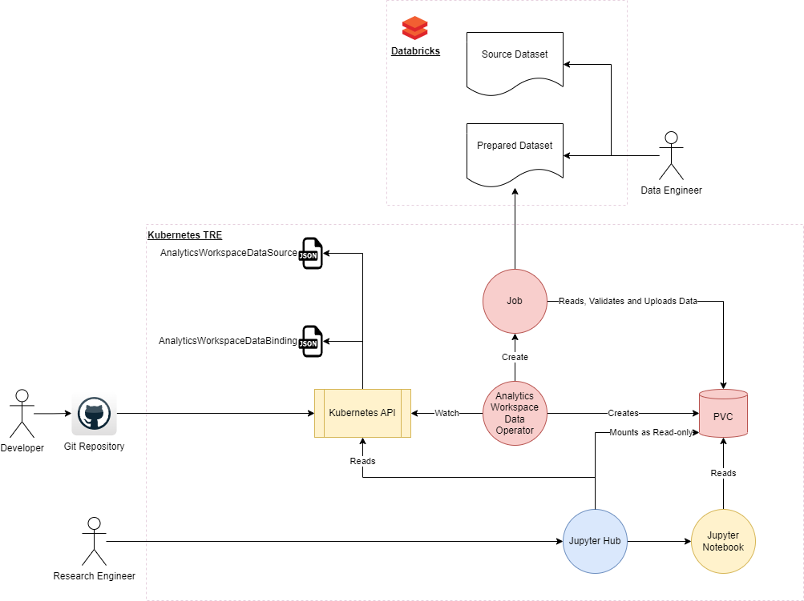
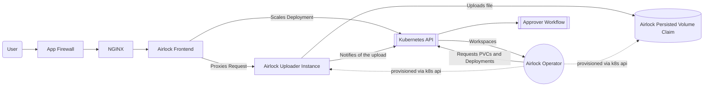

The solution will provide a collection of services that will provide for secure ingress and egress from the environment, these airlock services will provide capabilities for a number of different scenarios as outlined below.

In each case, the solution will provide a number of gates for the approval of data before it can be either ingressed or egressed from the environment.

## Scenarios

### Automated Ingress from a variety of source systems
Once the data has reached a gold standard, AWMS (Analytics Workspace Management Solution) will need to be imported into the system. Rather than the internal data engineer having to package this up and upload it manually, they should be able to tell the system where to find that source data and the system should then be able to collect it and import it into the system from the source directly.

To achieve this the following architecture will be used:



#### Components
##### Operator
The operator will watch for AnalyticsWorkspaceDataSource resources with a type of **Import**:

```yaml
apiVersion: xlscsde.nhs.uk/v1
kind: AnalyticsWorkspaceDataSource
metadata:
  name: example-data-source-1
  labels:
    xlscsde.nhs.uk/type: import
spec:
  type: Import
  publisher:
    organisation: NHS Greater Manchester ICB
    contact:
      name: Shaun Turner
      role: AWMS Developer

  project: 
    id: d4e6

  displayName: NWSDE Data Engineering Team Sample Dataset - GM Attendances
  description: |
    Contains two sample tables, one showing outpatient attendances by person and date, and another including demographic 
    information about the people attending. 
    
    All data is synthetic and doesn't reflect real world people or activity

  license: |
    This sample data may ONLY be used by the NW SDE Data Engineering and Technical teams for testing data processing 
    and pipelines within and adjacent to the NW SDE.

  connections:
  - type: databricks
    name: databricks
    url: https://example-databricks-instance.xlscsde.nhs.uk/path/to/datasource.location
    credentials:
      userKey: DatabricksUsername
      passwordKey: DatabricksPassword

  objects:
  - table:
      name: patients
      connection: databricks

  - table:
      name: attendances
      connection: databricks
```

If the dataState of the item is marked as READY and the stage is marked as undefined, the operator will:
* Create a Persistent Volume Claim with a configurable storageClass this will default to jupyter-default on the jupyterhub namespace. (This will in turn trigger the Azure Blob Storage CSI to provision a container on the storage account in question). 
* Create a secret containing credentials and connection strings for use by the Job container
* Create a Job that will spin up a container to download the data
* Wait for the job to report to complete
* If the job state is successful then Update the status of the AnalyticsWorkspaceDataSource to make the to mark it's datastate to Completed
* If the job state is failure then Update the status of the AnalyticsWorkspaceDataSource to make the to mark it's datastate to Failed

#### Jobs Runner Containers
A job runner container will read the definition provided in the AnalyticsWorkspaceDataSource and download the data to the director on the PVC created for this datasource. It will also attempt to create a corresponding ro-create-metadata.json file based on the information that has been extracted.

There may be many different variants of the Job Runner allowing for a variety of different data sources.

##### dlt Job Runner
This variant of the job runner will utilise the [dlt libraries](https://dlthub.com/) to perform the extraction of the data. This should allow collection from a variety of different sources.

### Manual Ingress 
This will take the form of a website, supported by our keycloak implementation which will allow for the uploading of data into a workspace.

Data will first be transferred into a secure, isolated file store for the workspace, this should ideally not be configured to use the same storage account as the persisted storage for the workspaces themselves.



Once the file has reached the airlock, the kubernetes API is notified of the upload which will then trigger the airlock ingress approval process.

#### Components
##### Operator 
The operator will watch the kubernetes control plane for AnalyticsWorkspaceDataSource resources with a type of **Uploaded**, when a resource is created or updated it will check to see whether a persistent volume claim (PVC) already exists relating to this data source. If not, it will provision a PVC for it of the storage class associated with staging storage. It will also provision the other resources needed to support the uploader such as:
* A deployment for the uploader service (scaled to zero replicas) that links to the provisioned PVC
* A Service to provide networking for the uploader service
* An ingress for the uploader service

##### Frontend Microservice
The frontend microservice consists of a basic API, when called it will check the assigned workspace for the user currently logged in, it will then look for existing AnalyticsWorkspaceDataSource resources or provide a form for the user to create a new one. 

```yaml
apiVersion: xlscsde.nhs.uk/v1
kind: AnalyticsWorkspaceDataSource
metadata:
  name: ds-782b4a1f07234229980f75f2f651412a
  labels:
    xlscsde.nhs.uk/type: uploaded
spec:
  type: Uploaded

  publisher:
    organisation: Some Organisation
    contact:
      name: Joe Bloggs
      role: Research Engineer

  project: 
    id: d4e6

  displayName: An uploaded example dataset
  description: |
    An example dataset which the user has brought for themselves and uploaded into the system.

  license: |
    This sample data may ONLY be used for demos

  connections:
  - type: pvc
    name: pvc-782b4a1f07234229980f75f2f651412a
```

Once the AnalyticsWorkspaceDataSource resource reports as created, it will check to see if the dataset being created is bound to the workspace for which it was uploaded. If not it will create the binding.

```yaml
apiVersion: xlscsde.nhs.uk/v1
kind: AnalyticsWorkspaceDataBinding
metadata:
  name: dsb-782b4a1f07234229980f75f2f651412a
spec:
  workspace: advanced-generic-workspace
  datasource: ds-782b4a1f07234229980f75f2f651412a
```

The service will then check if relevant uploader microservice is currently running, if not it will scale that deployment to 1 replica. It will watch the deployment resource and once it reports as ready it will redirect the browser session to the address of the relevant uploader service, where the user can then upload data.

##### Uploader Microservice
The uploader provides a basic API and some screens for the user to upload the data into the relevant asset area. The files uploaded will be uploaded into the containers mounted upload folder. Once the files have been uploaded, the user will confirm that all files have been uploaded. This will cause the system to update the status of the AnalyticsWorkspaceDataSource file to confirm that the datasource has been marked as ready for approval.

#### Please note
This functionality has not yet been implemented


### Automated Egress to predefined destination systems
In some instances it may be desirable to automatically publish the results of your research to a online website or an extranet site. As such it would be helpful to be able to publish this automatically as part of the process.

When a workspace is defined, any

#### Please note
This functionality has not yet been implemented

### Manual Egress of data

#### Please note
This functionality has not yet been implemented

## Approvals
The approvals process for the solution is currently largely manual, however provision in the design should allow for easy automation if you wish to do so.

A data approver will be able to login to the solution through the same means as a research engineer can, when the data approver role is detected, the data approver will be provided with a list of Data Sources that are currently awaiting approval in addition to any workspaces that they might have access to. When they select a data source, a predefined jupyter container will be started which will include the tools needed for an approver to review the data. This data will be mounted into the container as a read-only file file system. The approver can perform whatever task they want and they will also be provided with a screen in jupyter which will allow them to provide an approval or rejection of the data source that they are currently operating on. Unlike workspace containers, this container will not mount to any workspaces