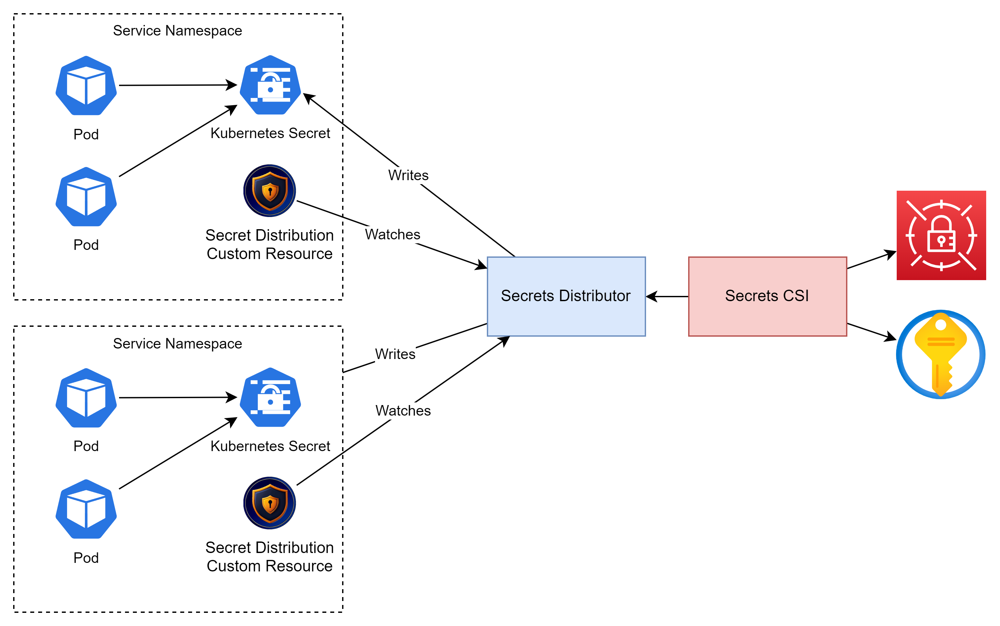

# Secrets Management
When looking at how to handle secrets in the solution, we had a number of things to consider:
* Every microservice will need to be configured individually for the secrets necessary
* Some services (such as jupyter hub) will need to be adapted to pass down individual configurations to the child pods that are created.
* Each namespace will need a SecretProviderClass configured with the individual secrets needed. 
* If there are any problems communicating with the secrets provider or with the CSI drivers themselves, the solution will shutdown
* Multiple services will make multiple calls to keyvault (or other provider) to get the same secrets.
* Relies on the helm chart working in a way that is flexible with mounting secrets in this manner. Problematic with third-party helm charts.
* Currently would need over 20 different Secret Provider Classes to be defined. This problem will grow as more microservices get added

# Introducing the Secrets Distributor
The secrets distributor is responsible to copying secrets around kubernetes allowing them to be used in pod definitions in multiple namespaces, Further information can be found in the [Secrets Distributor](./docker/secrets-distributor/) repository

## Development
The following repositories relate to our implementation of this component:
* [Docker Image](https://github.com/lsc-sde/docker-secrets-distributor)
* [Helm](https://github.com/lsc-sde/iac-helm-secrets-distributor)