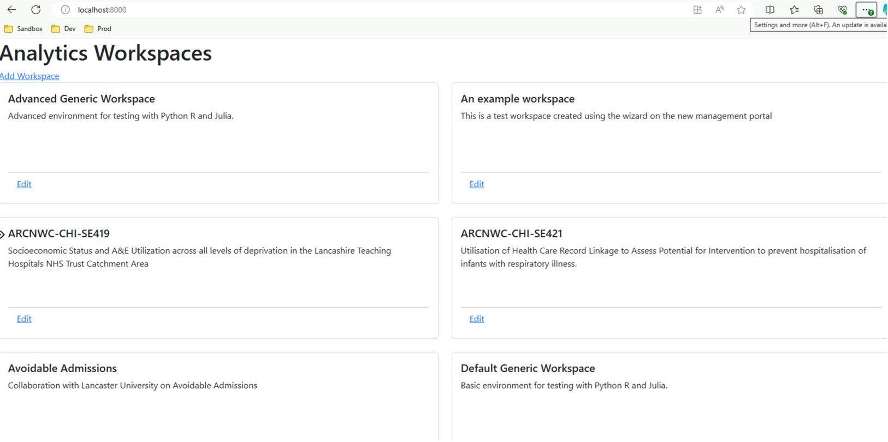

The solution should provide a management portal to allow administrators to maintain the various Workspaces, Data Sources and Bindings that make up the system.

Allowing you to perform a number of tasks such as:
* List workspaces

* Edit a workspace 

* Manage workspace bindings

## Please note
This functionality is currently in proof of concept