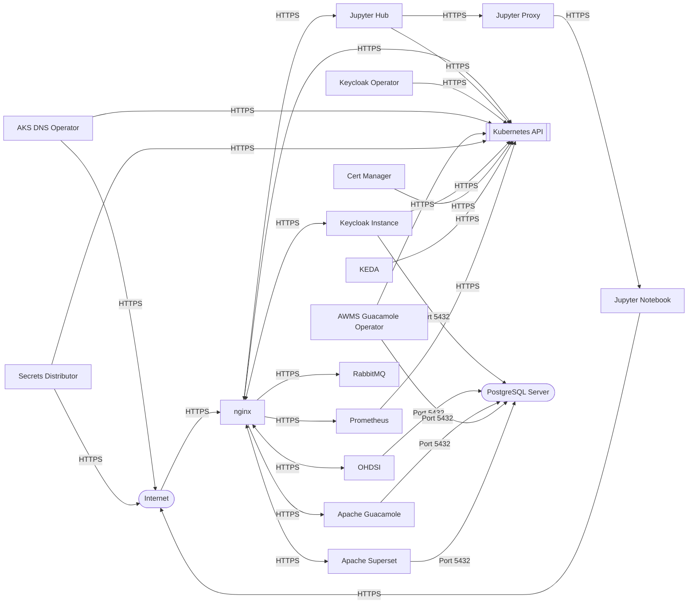

[Tigera Calico](https://docs.tigera.io/calico/latest/about/) is a networking and security solution that enables Kubernetes workloads and non-Kubernetes/legacy workloads to communicate seamlessly and securely.

Calico enforces the network policies defined within Kubernetes resource definitions and provides custom extensions to further extend those default capabilities.

Each service implements it's own Network Security Policies as part of it's individual [FluxCD configuration](../../Developer-Guide/IAC/FluxCD.md). The default network policies for the solution are listed below.

