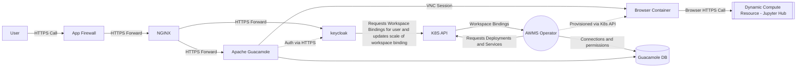

Apache Guacamole will make up part of the External Access Layer of the system. This will allow users from outside of the system to access the desktops of machines inside of our network via VNC or RDP.

Both Apache Guacamole and [keycloak](../Identity-and-Access-Management/Keycloak.md) can be made publicly accessible to provide public access to the solution while providing secure means to connect into the platform while ensuring workspace isolation.

Apache Guacamole is complimented by the [AWMS Guacamole Operator](../../imported/products/sde/analytics-workspace-management/awms-guacamole-operator/docs/operator.md) which provisions the browser containers for each workspace / user combination.  

