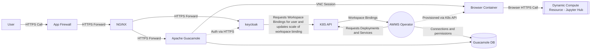

[Apache Guacamole](https://guacamole.apache.org/) is a clientless remote desktop gateway. It supports standard protocols like VNC, RDP, and SSH.

## Database
The Lancashire and South Cumbria Secure Data Environment uses an external postgresql server to provide RDBMS functionality to the application. In a cloud environment it is expected that this will be a managed postgresql server for these such as:
* [Azure Database for Postgresql Server](../Infrastructure/Elastic-Compute-Resource/Microsoft-Azure/Postgresql-Server.md)

In a baremetal environment it is expected that you would install the database on a seperate server, however you can install locally if needed, but this is not provided for in the implementation at present.

# VDI
Apache Guacamole will make up part of the External Access Layer of the system. This will allow users from outside of the system to access the desktops of machines inside of our network via VNC or RDP.

Both Apache Guacamole and [keycloak](../Identity-and-Access-Management/Keycloak.md) can be made publicly accessible to provide public access to the solution while providing secure means to connect into the platform while ensuring workspace isolation.

Apache Guacamole is complimented by the [AWMS Guacamole Operator](../../imported/products/sde/analytics-workspace-management/awms-guacamole-operator/docs/operator.md) which provisions the browser containers for each workspace / user combination.  

