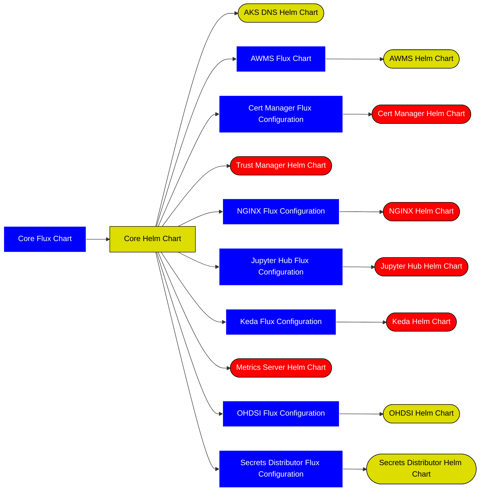
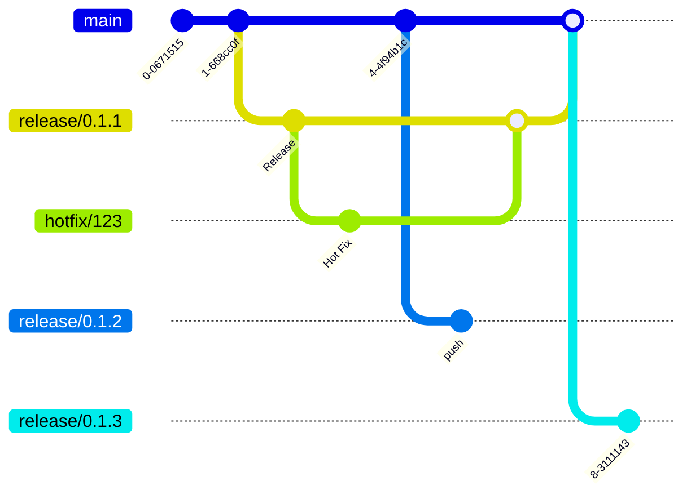

There is a chain of flux and helm charts that work together in order to deploy an environment



## Applying Hot-Fixes
When applying hot fixes to the environment we will typically identify the product branch effected from the [core flux repository](https://github.com/lsc-sde/iac-flux-lscsde). This repository uses a [different branching strategy](../Source-Control/Branching-Strategies/Core-Flux-Strategy.md) to the majority of the others.

This allows us to control which environment is using which version of the code and subsequently what versions of the various components we are using.

Once you've checked out the latest prod branch, you can then look at the release version for the effected component(s) by looking in either:
* core/deployment-config.yaml - in older releases (current prod)
* core/flux-config.yaml
* core/helm-config.yaml
* core/release.yaml

Looking into these files should tell you which version the components are, so say for making a change in prod that impacts the jupyter components, you will look into the core/deployment-config.yaml file and look for jupyter_branch and/or jupyter_chart_version. The branch is the branch in the [jupyter flux repository](https://github.com/lsc-sde/iac-flux-jupyter), the chart version is the version of the jupyter hub helm chart we're using.

```
apiVersion: v1
kind: ConfigMap
metadata:
  name: deployment-config
data:
  ohdsi_branch: "release/0.1.55-auth-disabled"
  ohdsi_chart_version: "0.1.30"
  secrets_distributor_chart_version: "0.2.4"
  certmanager_branch: "release/0.1.27"
  certmanager_chart_version: "v1.14.2"
  trustmanager_chart_version: "0.8.0"
  github_runner_branch: "release/0.1.54"
  github_runner_chart_version: "0.1.26"
  aks_dns_branch: main
  aks_dns_chart_version: "0.2.8"
  configmap_transformer_branch: main
  configmap_transformer_chart_version: "0.2.4"
  nginx_branch: "release/0.1.53"
  nginx_chart_version: "4.9.1"
  keda_branch: "release/0.1.39"
  keda_chart_version: "2.13.1"
  keycloak_branch: "release/0.1.60"
  jupyter_branch: "release/0.2.62"
  jupyter_chart_version: "3.2.1"
  analytics_workspace_management_chart_version: "0.1.13"
  analytics_workspace_management_branch: "release/0.1.10"
  metrics_server_chart_version: "3.12.0"
  guacamole_chart_version: "0.1.8"

```

You can see from the above that in this instance we'd be looking for branch **release/0.2.62** in the [jupyter flux repository](https://github.com/lsc-sde/iac-flux-jupyter). We will then checkout the repository which will use the standard branching strategy.



We will create a hotfix branch based upon the branch currently in use by this environment.

Once we have completed the changes and tested as throughly as we can we will PR this back into the release branch which we created the hotfix branch from. This will cause any environments using this version of the flux configuration to be updated within 10 minutes. We will watch the environment to make sure that this has the desired effect and once completed, we will then PR from the release branch back into the main branch to carry the change forward.