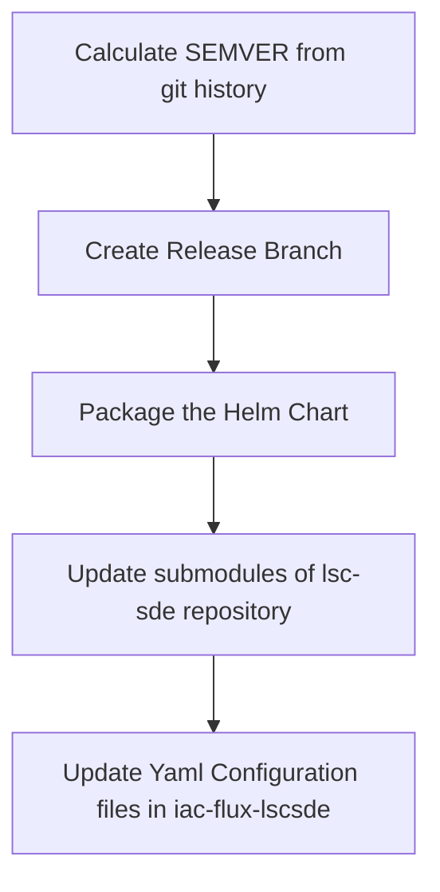

[Helm](https://helm.sh/) is a package manager for Kubernetes.

## Core Charts
* [lscsde-flux](https://github.com/lsc-sde/iac-helm-lscsde-flux)

## Application Charts
* [Analytics Workspace Management](https://github.com/lsc-sde/iac-helm-analytics-workspace-management)
* [Apache Guacamole](https://github.com/lsc-sde/iac-helm-guacamole)
* [OHDSI](https://github.com/lsc-sde/iac-helm-ohdsi)

## Utility Charts
* [AKS DNS Operator](https://github.com/lsc-sde/iac-helm-aks-dns-operator)
* [Secrets Distributor](https://github.com/lsc-sde/iac-helm-secrets-distributor)
* [ConfigMap Transformer Controller](https://github.com/lsc-sde/iac-helm-configmap-transformer-controller) - deprecated
* [github-actions-runner](https://github.com/lsc-sde/iac-helm-github-actions-runner) - deprecated

## Helm Repository
The above charts are made available by github pages, which is configured against the main branch of this repository

The [core chart to call is lscsde-flux](https://github.com/lsc-sde/iac-helm-lscsde-flux), this will install all of the flux/helm required to setup an environment.

### adding to the repository
There are pipelines on each of the helm repositories which will:

This will in turn trigger the pipeline for [the flux repositories](./FluxCD.md)