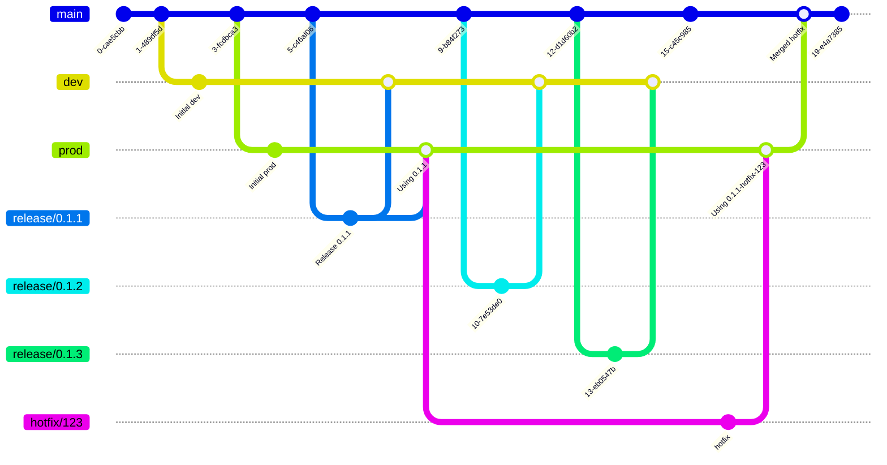

The core flux repository uses a different branching strategy to the default

```mermaid
gitGraph LR:
    commit
    commit
    
    branch dev
    checkout dev
    commit id: "Initial dev"
    checkout main
    commit

    branch prod
    checkout prod
    commit id: "Initial prod"
    checkout main
    commit

    branch release/0.1.1
    checkout release/0.1.1
    commit id: "Release 0.1.1"
    
    checkout dev
    merge release/0.1.1


    checkout prod
    merge release/0.1.1 id: "Using 0.1.1"

    checkout main
    commit

    branch release/0.1.2
    checkout release/0.1.2
    commit

    checkout dev
    merge release/0.1.2

    checkout dev
    checkout prod

    checkout main
    commit

    branch release/0.1.3
    checkout release/0.1.3
    commit

    checkout dev
    merge release/0.1.3

    checkout main
    commit

    checkout prod
    branch hotfix/123
    commit id: "hotfix"
    
    checkout prod
    merge hotfix/123 id: "Using 0.1.1-hotfix-123"

    checkout main
    merge prod id: "Merged hotfix"
    commit
```
