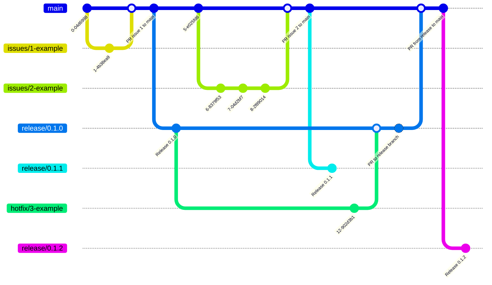

The default strategy, relies on pull requests into the main branch, the pipelines will then automatically push out a new release branch for the impacted repository and any dependencies.

The downside of this strategy is that it will create a large number of branches on each repository, however this is on purpose as it will automatically update the various flux configurations, helm charts, image versions, etc making it easier to manage the large number of repositories overall. 