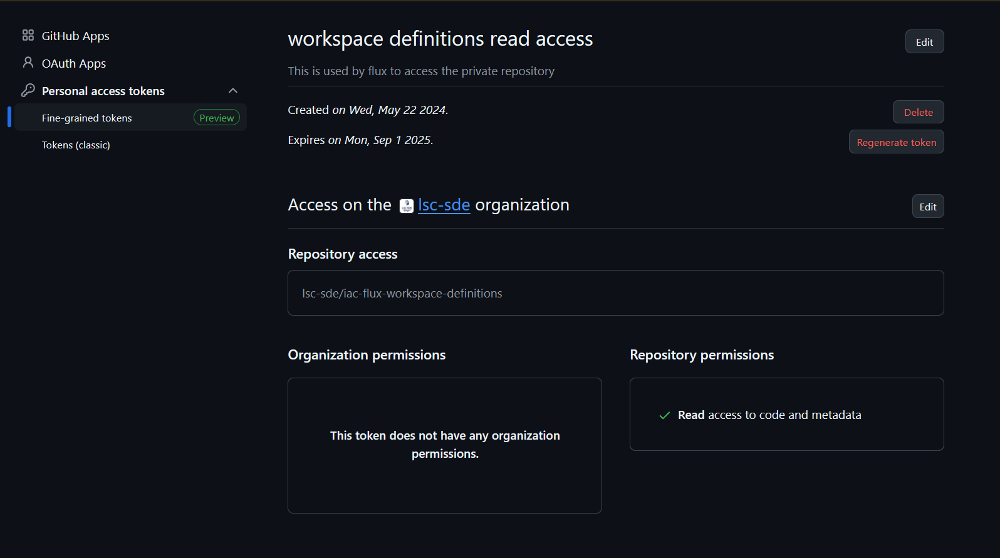
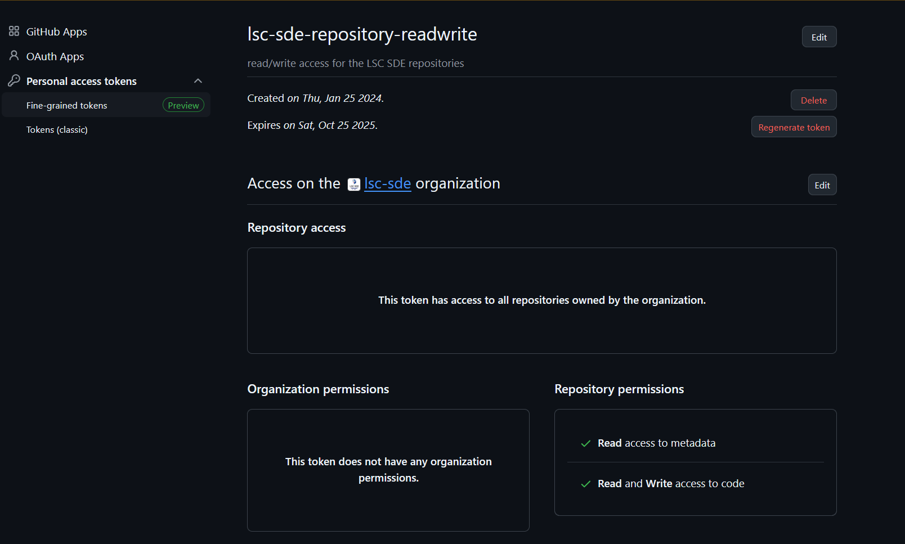

# Tokens and Secrets
There are a number of secrets and tokens inside of the solution which allow the solution to perform a number of actions. These sometimes rely on PAT tokens and as such need to be updated from time-to-time.

## Pypi Packages
PyPi packages are currently uploaded manually at the discression of the lead developer.

This is currently uploaded via the shaun.turner1-nhs-net account as there is no organisation.

TODO: This should be automated in future and should either be created as an organisation in pypi or should be uploaded to another repository elsewhere as an organisaton.

## Terraform Secrets
When terraform is called, it currently carries in secrets via the following environmental variables

### TF_VAR_pat_token
This Github PAT Token is used to gain read-only access to the private repositories such as github.com/lsc-sde/iac-flux-workspace-definitions

To generate this token a user with read access to the iac-flux-workspace-definitions should create a fine-grained token with the following settings:

Note: This secret will be propagated into Azure Keyvault where it will be stored and updated when the terraform is updated.

## Github Secrets
### lsc-sde-crates Organisation
#### Organisation Secrets
##### REPOS_RW_TOKEN

This is used by multiple workflows to give read/write capabilities against the repositories on the lsc-sde repositories (due to limitations in github working with numerous repositories at once).

TODO: This should be reworked to remove the need for this.

To generate this token someone with org level read/write permissions to the repositories on the lsc-sde organisation should create a fine-grained token with the following permissions:

####  Github Repository Secrets
##### cr8tor-publisher
No secrets defined

### lsc-sde Organisational 
#### Organisation Secrets
The following are organisation level secrets in github actions which are used by the solution.

https://github.com/organizations/lsc-sde/settings/secrets/actions

##### DOCKERHUB_TOKEN
This is used in the docker build process as credentials for the dockerhub lscsde account (currently configured against shaun.turner1@nhs.net). This account can be converted to an organisation or moved to another email address if required, however the plan has and should be to migrate to using ghcr.io so that we can leverage the organisational features of github. 

https://github.com/lsc-sde/lsc-sde/blob/main/.github/workflows/docker-build.yaml

##### DOCKERHUB_USERNAME

This is used in the docker build process as credentials for the dockerhub lscsde account (currently configured against shaun.turner1@nhs.net). This account can be converted to an organisation or moved to another email address if required, however the plan has and should be to migrate to using ghcr.io so that we can leverage the organisational features of github. 

https://github.com/lsc-sde/lsc-sde/blob/main/.github/workflows/docker-build.yaml

To generate a new PAT Token please follow the instructions on the docker hub website:

https://docs.docker.com/security/for-developers/access-tokens/

##### GH_PACKAGE_TOKEN
This no longer appears to be used and should be possible to delete this

##### OSSRH_TOKEN
This is used by maven to login to the maven central repository to upload java packages. 

https://github.com/lsc-sde/java-analytics-workspace-management-models/blob/main/.github/workflows/build.yaml

To generate the OSSRH token please follow the documentation on the sonatype website:

https://central.sonatype.org/publish/generate-token/

##### OSSRH_USERNAME
This is used by maven to login to the maven central repository to upload java packages. 

https://github.com/lsc-sde/java-analytics-workspace-management-models/blob/main/.github/workflows/build.yaml

To register a new account, please follow the instructions on the sonatype website:

https://central.sonatype.org/register/central-portal/

##### REPOS_RW_TOKEN
This is used by multiple workflows to give read/write capabilities to different repositories when calling actions on multiple repositories (due to limitations in github working with numerous repositories at once)

https://github.com/lsc-sde/lsc-sde/blob/main/.github/workflows/flux.yaml
https://github.com/lsc-sde/lsc-sde/blob/main/.github/workflows/update-submodules.yaml
https://github.com/lsc-sde/lsc-sde/blob/main/.github/workflows/update-yaml.yaml
https://github.com/lsc-sde/lsc-sde/blob/main/.github/workflows/helm-package.yaml
https://github.com/lsc-sde/lsc-sde/blob/main/.github/workflows/generate-java-crds.yaml

TODO: This should be reworked to remove the need

To generate this token someone with org level read/write permissions to the repositories on the lsc-sde organisation should create a fine-grained token with the following permissions:

#### Repository Secrets

##### awms-crate-operator
No Secrets Defined

##### awms-datasource-operator
No Secrets Defined

##### awms-guacamole-operator
No Secrets Defined

##### awms-keycloak-extensions
No Secrets Defined

##### devcontainer-features 
No Secrets Defined

##### docker-aks-dns-operator
The following secrets are defined:

###### SANDBOX_AZ_CREDENTIALS
Used by terraform to login to azure and apply/destroy.

https://github.com/lsc-sde/iac-terraform-azure/blob/main/.github/workflows/apply.yaml
https://github.com/lsc-sde/iac-terraform-azure/blob/main/.github/workflows/destroy.yaml

These pipelines are currently unused and this secret has not been updated in some time.

Currently all terraform apply's are being handled manually via the tre jump server.

To generate a new token, this can be completed from the Entra App Registration portal:

https://portal.azure.com/#view/Microsoft_AAD_RegisteredApps/ApplicationMenuBlade/~/Credentials/appId/06269993-fdc2-426a-858b-018a525fcba0/isMSAApp~/false

##### docker-analytics-vnc-client 
No Secrets Defined

##### docker-analytics-workspace-mgmt
No Secrets Defined

##### docker-apache-superset
No Secrets Defined

##### docker-configmap-transformer-controller
No Secrets Defined

##### docker-dataengineering-sqlmesh-notebook 
No Secrets Defined

##### docker-datascience-jupyter-omop 
The following secrets are defined

###### PAT_TOKEN
TODO: This appears to have been generated by @m1p1h, please can you document what this is for and what level of access is required

##### docker-datascience-notebook 
No Secrets Defined

##### docker-datascience-notebook-default 
No Secrets Defined

##### docker-jupyterhub 
No Secrets Defined

##### docker-llm-workspace  
No Secrets Defined

##### docker-ohdsi-atlas  
No Secrets Defined

##### docker-ohdsi-hades 
No Secrets Defined

##### docker-ohdsi-webapi 
No Secrets Defined

##### docker-secrets-distributor 
No Secrets Defined

##### docker-template
No Secrets Defined

##### iac-flux-aks-dns-operator 
No Secrets Defined

##### iac-flux-analytics-workspace-management
No Secrets Defined

##### iac-flux-apache-superset 
No Secrets Defined

##### iac-flux-certmanager 
No Secrets Defined

##### iac-flux-configuration
No Secrets Defined

##### iac-flux-example-workspace-definitions 
No Secrets Defined

##### iac-flux-github-action-runners 
No Secrets Defined

##### iac-flux-guacamole 
No Secrets Defined

##### iac-flux-jupyter
No Secrets Defined

##### iac-flux-keda 
No Secrets Defined

##### iac-flux-keycloak 
No Secrets Defined

##### iac-flux-lscsde 
No Secrets Defined

##### iac-flux-lscsde-components
No Secrets Defined

##### iac-flux-lscsde-configuration
No Secrets Defined

##### iac-flux-lscsde-namespaces 
No Secrets Defined

##### iac-flux-nginx
No Secrets Defined

##### iac-flux-observability-metrics
No Secrets Defined

##### iac-flux-ohdsi 
No Secrets Defined

##### iac-flux-prefect-server 
No Secrets Defined

##### iac-flux-rabbitmq 
No Secrets Defined

##### iac-flux-secrets-distributor 
No Secrets Defined

##### iac-flux-workspace-definitions
No Secrets Defined

##### iac-helm-aks-dns-operator 
No Secrets Defined

##### iac-helm-analytics-workspace-management 
No Secrets Defined

##### iac-helm-configmap-transformer-controller 
No Secrets Defined

##### iac-helm-datashield
No Secrets Defined

##### iac-helm-github-actions-runner 
No Secrets Defined

##### iac-helm-guacamole 
No Secrets Defined

##### iac-helm-lscsde-flux 
No Secrets Defined

##### iac-helm-lscsde-namespaces
No Secrets Defined

##### iac-helm-repository
No Secrets Defined

##### iac-helm-secrets-distributor 
No Secrets Defined

##### iac-terraform-azure 
###### SANDBOX_AZ_CREDENTIALS
Used by terraform to login to azure and apply/destroy.

https://github.com/lsc-sde/iac-terraform-azure/blob/main/.github/workflows/apply.yaml
https://github.com/lsc-sde/iac-terraform-azure/blob/main/.github/workflows/destroy.yaml

These pipelines are currently unused and this secret has not been updated in some time.

Currently all terraform apply's are being handled manually via the tre jump server.

To generate a new token, this can be completed from the Entra App Registration portal:

https://portal.azure.com/#view/Microsoft_AAD_RegisteredApps/ApplicationMenuBlade/~/Credentials/appId/06269993-fdc2-426a-858b-018a525fcba0/isMSAApp~/false

###### SANDBOX_AZ_CREDENTIALS_LIMITED_PERMISSIONS
Used by terraform to login to azure and apply/destroy.

https://github.com/lsc-sde/iac-terraform-azure/blob/main/.github/workflows/apply.yaml
https://github.com/lsc-sde/iac-terraform-azure/blob/main/.github/workflows/destroy.yaml

These pipelines are currently unused and this secret has not been updated in some time.

Currently all terraform apply's are being handled manually via the tre jump server.

To generate a new token, this can be completed from the Entra App Registration portal:

https://portal.azure.com/#view/Microsoft_AAD_RegisteredApps/ApplicationMenuBlade/~/Credentials/appId/06269993-fdc2-426a-858b-018a525fcba0/isMSAApp~/false

##### java-analytics-workspace-management-k8s-api 
No Secrets Defined

##### java-analytics-workspace-management-models 
No Secrets Defined

##### lsc-sde 
No Secrets Defined

##### py-kubespawner-keycloak 
No Secrets Defined

##### py-lscsde-workspace-mgmt 
No Secrets Defined