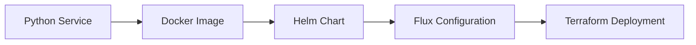

# Checking out the code
```bash
git clone https://github.com/lsc-sde/lsc-sde.git --recurse-submodules
cd lsc-sde
git submodule foreach "git switch main"
```

# Development Principles / Best Practice
Before you start developing on these projects, please take the time to read this section on best practice. These are not just about good practice but also about good security and so it is essential that every developer understands that it is their responsibility to upkeep the standards of these projects.

## Everything Open Source
A decision has been made that all components of this project will be made open source under an MIT License. Each repository should have this license in the top of the project. In addition to this all container images will be made available on docker hub as public repositories. The exceptions to this may occur when we are interacting with proprietry software provided by external providers as needed for the project, however preference should be given to secure open source software rather than proprietry software. 

This allows us to maximise collaboration with other organisations and individuals in order to improve the services we're offering. 

## Keeping things Generic
As we are developing open source solutions it is important that every service we build should be designed in a manner that is as generic as possible, meaning that it will work in any environment. As a result we should not put any environment specifics into any applications or services. Environment config should be handled by the deployment of it on its relevant cluster as close to the cluster configuration as possible.

For example, if we are building a new service, such as the aks-dns-operator, this has code in the form of:



In this example, we reference a number of environmental variables from the application:
* PRIVATE_DNS_ZONE
* DNS_PREFIX
* AZ_SUBSCRIPTION_ID
* RESOURCE_GROUP_NAME

Each of these has a default value of an empty string. These same variables are then referenced in the docker image definition, but only to let us know that these are available variables for the docker image metadata.

The helm chart then has a section for environment variables in the values file but this is also empty.

On our flux configuration we start to see some of these environmental variables be defined:

```yaml
env:
- name: AZURE_CLIENT_ID
  value: ${azure_client_id}

- name: AZURE_TENANT_ID
  value: ${azure_tenant_id}

- name: DNS_PREFIX
  value: ${dns_prefix}

- name: AZ_SUBSCRIPTION_ID
  value: ${dns_subscription_id}

- name: PRIVATE_DNS_ZONE 
  value: ${private_dnz_zone}
  
- name: RESOURCE_GROUP_NAME
  value: ${dns_resource_group}
```

however you will note that these are coming from substitution in the flux configuration and actually come from a environment configuration configured by the terraform.

```terraform
module "kubernetes_cluster_configuration" {
  ...
  cluster_configuation = {
    "azure_client_id" = module.kubernetes_cluster.kubelet_identity_client_id
    "azure_keyvault_name" = module.key_vault.name
    "azure_storage_account" = module.storage_account.name
    "azure_tenant_id" = data.azurerm_client_config.current.tenant_id
    "private_dnz_zone" = var.dns_zone
    "dns_prefix" = var.dns_prefix
    "dns_resource_group" = var.private_zone_resource_group_name
    "dns_subscription_id" = var.hub_subscription_id
    "azure_subscription_id" = data.azurerm_client_config.current.subscription_id
    "azure_sql_server" = module.sql_server.name
    "azure_resource_group" = module.resource_group.name
    "azure_location" = var.location
  }
}
```
So the source data is coming from terraform and is built automatically by the system, as is.

## Secrets
Never store any secrets inside of the repository, secrets should be stored in a secure vault such as azure key vault and distributed to the relevant services. A default key vault is configured as part of the terraform deployment for the azure environment. This can be accessed using the user managed identity via the CSI driver for secrets. These secrets can then be distributed by the secrets distributor service. For local development environments, an equivalent secret can be created and mounted into the secrets distributor service.

As in the section entitled *Keeping things generic* we should keep these as close to the environment as possible.

An example of this might be the *Cookie Secret* used by jupyter hub. This is in the helm chart used for jupyterhub as the following value:
```yaml
hub:
    cookieSecret: "******"
```

This is passed in via the flux configuration to the HelmRelease resource in the valuesFrom section:

```yaml
...
spec:
  valuesFrom:
  - kind: Secret
    name: jupyter-cookie
    valuesKey: jupyterhub_cookie_secret
    targetPath: hub.cookieSecret
```

This in turn comes from a secret called jupyter-cookie. This secret is created by the secret distributor using the following custom resource:

```yaml
apiVersion: xlscsde.nhs.uk/v1
kind: SecretsDistribution
metadata:
  name: jupyter-cookie
  annotations:
    xlscsde.nhs.uk/secretUsage: "Jupyter Cookie Secret"
spec:
  name: jupyter-cookie
  secrets:
  - from: JupyterCookieSecret
    to: jupyterhub_cookie_secret
```

Which in turns pulls from a secret served by the secret distributor called *JupyterCookieSecret*. This is actually stored in key vault and served into the secret distributor as a volume using the CSI driver:

```yaml
volumeMounts:
  - name: secrets-store-inline
    mountPath: /mnt/secrets
    readOnly: true
volumes:
  - name: secrets-store-inline
    csi:
      driver: secrets-store.csi.k8s.io
      readOnly: true
      volumeAttributes:
        secretProviderClass: "keyvault-sync"
```

Which in turn refers to a secretProviderClass called keyvault-sync which exists in the cluster configuration:

```yaml
apiVersion: secrets-store.csi.x-k8s.io/v1
kind: SecretProviderClass
metadata:
  name: keyvault-sync
  namespace: secrets-distributor
  annotations:
    xlscsde.nhs.uk/secretUsage: "Key Vault Sync"
spec:
  provider: azure
  parameters:
    usePodIdentity: "false"
    useVMManagedIdentity: "true"
    userAssignedIdentityID: ${azure_client_id}
    keyvaultName: ${azure_keyvault_name}
    tenantId: "${azure_tenant_id}"
    objects: |
        array:
        ...
        - |
          objectName: JupyterCookieSecret
          objectType: secret
```

This in turn gets what it needs to connect to the key vault from the substitutions which again come from the environment config configmap deployed by terraform.

## Repository Splitting
In order to keep the solution as modular as possible, each repository should have a specific category and type of code inside. If for example we're building a service such as the aks-dns-operator, we should split out all the various components into their own repositories:

* Docker Image (this can include the application itself)
* Helm Chart
* Flux Configuration

Rather than having one repository for everything. The rationale behind this is that we may have contributors in the future who wish to contribute to the docker image, but not to the helm chart, or to the flux configuration. It allows us to compartmentalise everything and maintain separate versions of each component individually allowing us to move in different directions at a later date if necessary.

## Repository Naming
Please ensure that each repository is named according to its type and purpose:

### Flux repositories
Flux repositories should be named as follows:

```
iac-flux-{name}
```

### Helm repositories
Helm repositories should be named as follows:

```
iac-helm-{name}
```

### Container Images
Docker container images should be named as follows:

```
docker-{name}
```

# Getting Setup
The following is a guide to getting setup with all the tools needed to run the environment locally.

## Docker Desktop (for windows)
A guide to installing docker desktop is available on the the docker desktop website:

https://docs.docker.com/desktop/install/windows-install/

It is recommended to use WSL2 to run docker desktop rather than windows hypervisor. Once docker desktop is installed, you can test by running the following command:

```
docker ps
``` 

If the above command does not throw any exception, run nothing. Once completed and functioning correctly, you will need to install kubernetes:

https://docs.docker.com/desktop/kubernetes/

Once install is completed, you can switch context and run basic commands on the local cluster:

```powershell 
kubectl config use-context docker-desktop
kubectl get namespaces 
```

This should return a list of namespaces on the cluster.

## Helm
Instructions for installing helm can be found on the helm website:

https://helm.sh/docs/intro/install/


## Flux
Installation for installing flux can be found on the flux website:

https://fluxcd.io/flux/installation/

Once installed you can then install the various components using the instructions present in [each flux repository](./Secure-Data-Environment/Infrastructure/IAC/FluxCD.md). It is recommended that you install any components classified as core-components

## Azure CLI
Instructions for installing the Azure CLI can be found on the azure website:

https://learn.microsoft.com/en-us/cli/azure/install-azure-cli

Once installed, you can login via the following command

```bash
az login --tenant f12f0279-8a84-4068-8322-7a6fb0f839b8
```

This assumes that you are going to be talking to the LSCICS.onmicrosoft.com tenant and in all likeliness that this will not be the only tenant that you are a member of.

## Terraform
Instructions for installing terraform are available on the hashicorp website:

https://developer.hashicorp.com/terraform/install

