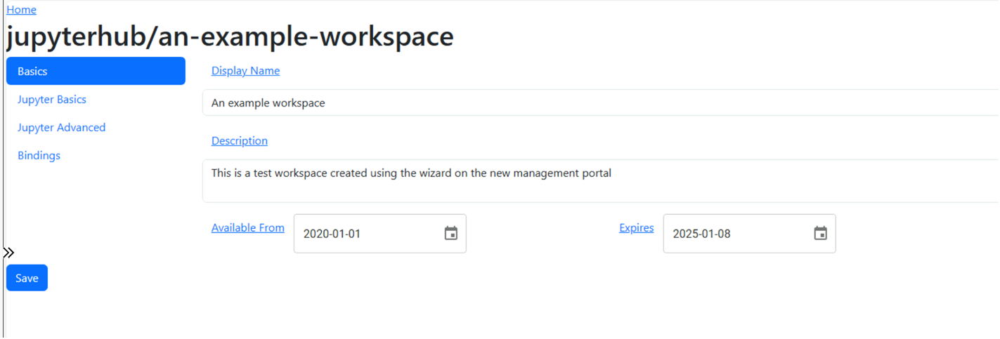
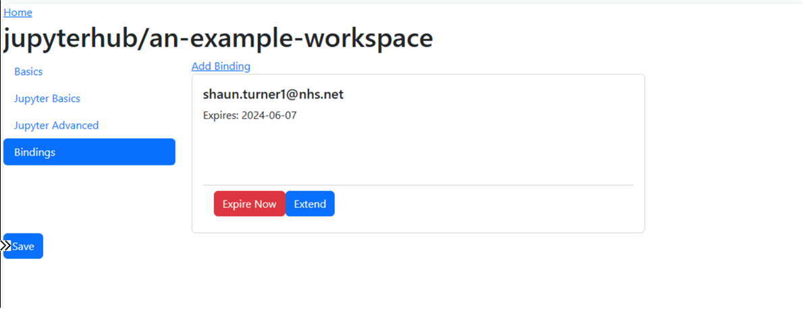

# AWMS Portal
The Lancashire and South Cumbria Secure Data Environment (LSC-SDE) [Analytics Workspace Management Solution](../Analytics-Workspace-Management-Solution.md) (AWMS) provides a portal to allow users to manage the various aspects of the LSC-SDE solution.


Allowing you to perform a number of tasks such as:
* List workspaces


* Edit a workspace 


* Manage workspace bindings


## Features
* [Roles Based Access Controls](./Management-Portal/Roles-Based-Access-Controls.md)
* Management of Resources such as [Analytics Workspaces](./Resources/Analytics-Workspaces.md) and associated [bindings](./Resources/Analytics-Workspace-Bindings.md)

## Development
* [Python Module - Workspace Management](https://github.com/lsc-sde/py-lscsde-workspace-mgmt)
* [Docker Image - Management Portal](https://github.com/lsc-sde/docker-analytics-workspace-mgmt)

## Accessing the AWMS Portal
At present access to the AWMS Portal is only accessible via port forwarding:

```bash
kubectl port-forward svc/analytics-workspace-management -n lscsde-workspace-mgr 8000:8000
```

You can then access the portal via the following link:

http://localhost:8000/

### Notice
This is a temporary situation until the portal can be properly secured.