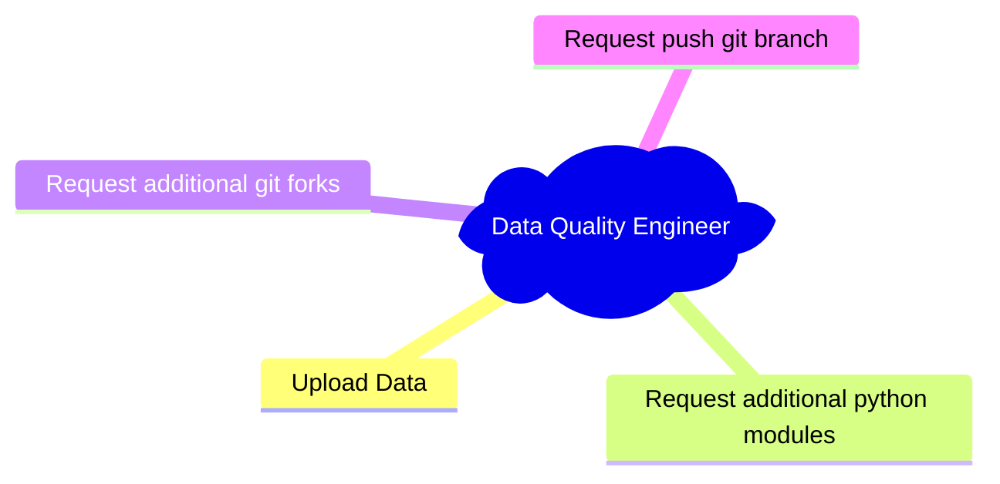

# Data Quality Engineer
The Data Quality Engineer is given to users that will be responsible for uploading quality data into the system, in the management portal the user will be able to:

## Notice
This is planned functionality, but not yet implemented