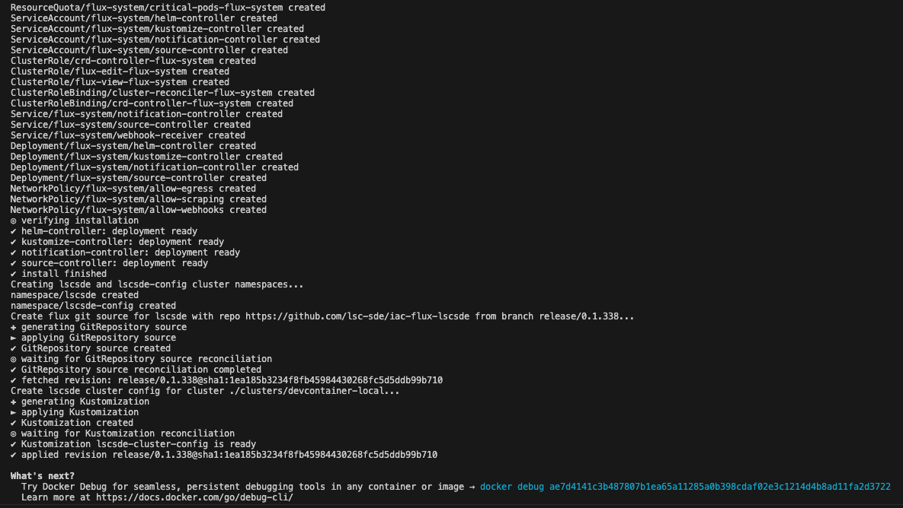
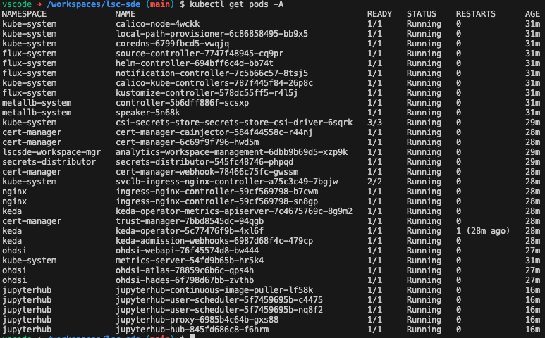

# Devcontainer Guide
The LSC devcontainer provides a consistent and reproducible development environment that removes the need to go through the process of preparing a local development machine with tooling and configuration specific to LSCSDE. In addition, it enables development from GitHub Codespaces as well as a local machine with the use of VS Code and Docker Desktop (see [here](https://code.visualstudio.com/docs/devcontainers/containers) for more details).

### Devcontainer Features

The following is a list of devcontainer features offered by the LSC-SDE:

| Name | Description |
| --- | --- |
| [k3d](./Devcontainer/Features/k3d.md) | Implementation of k3d on top of docker-in-docker the allows for running a kubernetes instance from within the devcontainer |
| [fluxcd](./Devcontainer/Features/fluxcd.md) | Implementation of fluxcd that runs on top of k3d in the devcontainer |
| [aks-tools](./Devcontainer/Features/aks-tools.md) | A collection of tools and scripts designed to make it easier to interop with Azure Resource Manager and AKS |
| [jupyterhub](./Devcontainer/Features/jupyterhub.md) | Install tools and scripts that allow a standalone version of jupyterhub to be installed alongside all of the tools needed for the LSC-SDE's Analytics workspace management solution, allowing us to rapidly develop and test new features for both tools inside of the devcontainer |
| [ohdsi](./Devcontainer/Features/ohdsi.md) | A collection of tools and scripts designed to make it easier to implement a standalone version of the OHDInetes implementation that will run on top of k3s inside of the devcontainer |
| [lscsde](./Devcontainer/Features/lscsde.md) | A collection of tools and scripts designed to allow development and deployment of the LSCSDE in various environments allowing LSCSDE developers, testers and release managers to work on this project with all the tools needed at their disposal. |

### Devcontainer Services
The devcontainer for LSCSDE consists of a docker-in-docker instance that is running a k3d registry and a k3d cluster on which all the components for the LSCSDE can be installed, it also provides supporting tools such as:
    - Terraform
    - Helm
    - Azure-cli
    - K3d
    - Kubectl
    - FluxCD 2
    - Docker
    - Python and relevant modules

The features also provide a collection of commands and shortcuts to allow rapid management, development and testing of environments.

### K8s Local Cluster
The devcontainer creates and provisions a local K8s cluster using K3s - a lightweight Kubernetes distribution for resource-constrained environments (e.g.  IoT/edge devices). K3s optimises for a low memory footprint (similar to microK8s) and runs on various OSs and architectures (i.e. Linux and Windows, arm64/amd64). K3d acts as a utility tool that facilitates the creation of K8s clusters using K3s inside Docker containers. The devcontainer uses K3d to create a lightweight cluster (lscsde) running in a docker-in-docker (dind) container. For more details on K3d see [here](https://k3d.io/v5.6.3/). In addition, kubectl is also made available to manage the local cluster.


## Get Started
To get started with the devcontainer, open VS Code and clone the lsc-sde root repository (https://github.com/lsc-sde/lsc-sde ). For deploying locally, ensure you have Docker Desktop running. Ensure your local machine has a specification to comfortably run the lscsde cluster. We recommend that your local Docker Desktop resource allocation has a minimum:
- 16 Core CPU
- 6GB RAM
- 200GB virtual disk allocation

If your local machine is unable to meet these requirements the LSCSDE cluster can become unstable and result in K8s pod evictions. In this case, choose instead to deploy the devcontainer within a Github Codespaces environment from your local VS Code environment (more details [here](https://docs.github.com/en/codespaces/developing-in-a-codespace/using-github-codespaces-in-visual-studio-code)).

### Secrets Distributor
Currently, the lscsde requires the developer to make available a ‘secrets’ directory that contains files which include credentials to allow deployed k8s services to authenticate and communicate. The developer must request access to this directory and place it in the directory .devcontainer/k3d/volume once they have pulled the root lsc-side repository to their local machine which must be named “secrets” aka .devcontainer/k3d/volume/secrets. The devcontainer looks for this directory on startup and attempts to mount it into the devcontainer for the secrets-distributor to consume. If the folder is empty it will attempt to create the secrets using random values to allow you to get started.

### Running the devcontainer
To build and run the container locally, open the command palette (Fn + F1 on mac) and type ‘> Dev containers: Rebuild Container’ and Enter to build and run the devcontainer. On the first build, this can take upto 5-10 minutes but once built is much quicker. Monitor the terminal for build logs, once completed you should see a similar output shown below:
{: width="100%"}

#### Codespaces from VS Code
You can also deploy the devcontainer into a remote Github Codespaces environment from your local VS Code IDE. To do so:
- Install the GitHub Codespaces Extension: First, you need to install the GitHub Codespaces extension in your local VS Code instance. You can find this extension in the Visual Studio Code Marketplace. Install it and follow any setup instructions.

- Sign in to GitHub: Make sure you're signed in to your GitHub account within VS Code.

- Open Command Palette: Open the command palette in VS Code by pressing Ctrl + Shift + P (Windows/Linux) or Cmd + Shift + P (Mac).

- Connect to a Codespace: In the command palette, type "Codespaces: Connect to a Codespace" and select it. This will prompt you to choose a GitHub repository that has Codespaces enabled.

- Select a Codespace: After selecting the repository, you'll see a list of available Codespaces associated with that repository. Choose the Codespace you want to connect to.

- Wait for the Connection: VS Code will now connect to the selected Codespace. This may take a few minutes

- Work in Codespace: Once connected, you can start working in the Codespace directly from your local VS Code instance.

- Save Changes: Any changes you make will be reflected in the Codespace, and you can commit, push, and pull changes as usual.

- Disconnect: When you're finished working, you can disconnect from the Codespace by running the "Codespaces: Disconnect from Codespace" command from the command palette. 

Whether deploying locally or in Codespaces, at this point the devcontainer environment is up and running with a k3d cluster and flux will begin to reconcile and deploy LSCSDE services and resources. It can take upto 10-15 minutes before the LSCSDE cluster stabilises.

In the meantime, ensure that cluster applications are accessible from the devcontainer. For ohdsi and jupyter services ensure that the /etc/hosts file on the devcontainer instance includes relevant hostname mappings to the loadbalancer IP. To find the loadbalancer IP call:

```bash
kubectl get svc/ingress-nginx-controller -n nginx -o=jsonpath="{.status.loadBalancer.ingress[0].ip}"
```
Then set the hostnames to the IP in etc/hosts e.g. 

```bash
echo '172.19.0.3 jupyter.cluster.lsc-sde.local ohdsi.cluster.lsc-sde.local' >> /etc/hosts
```

To access web services from your host machine browser, go to the ports tab in vs code while the devcontainer is running and add port forwarding for the relevant services e.g.:
{: width="100%"}

Once the devcontainer has been built and deployed you’ll have an isolated development environment with a running K8s cluster named ‘lscsde’ along with all lscsde components.

Run the command below to confirm all services are running:
```bash
kubectl get pods -A
```
The output should look similar to:

{: width="100%"}

This initial version of the devcontainer automates all of the setup instructions outlined [here](./New-Environment.md) and installs all tooling discussed [here](../../Developers.md).

### Devcontainer Restart
On re-connecting to the devcontainer, any previous cluster will be deleted and a clean cluster will be initialised by default.
## Important Notes
### Workspace Volume
For performance reasons, the devcontainer mounts an empty volume for the source code, the code will then be checked out from the main branch of the core repository automatically when the container first starts. This means that your local source code may be out of sync with the source code inside of the devcontainer, so be sure to keep these in sync before making changes to the devcontainer configuration itself on your local machine.

## Develop against specific components
The LSC-SDE is made up of a number of components which work together to provide the solution, installing all components and running these locally all the time creates a lot of pressure on dev machines and the updating of these can be slow development, as a result we have provided a number of scripts for each component which will do a barebones install to allow you to see how your changes have impacted on the solution.

For example, if you run the command:

```bash
setup-jupyterhub
```

The solution will build the various libraries, the docker images and deploy an instance of jupyter hub to jh-test along with all the supporting components (including the Analytics Workspace Management Solution). This allows you to test how the service reacts to the changes you've made on your local environment without having to deploy everything.