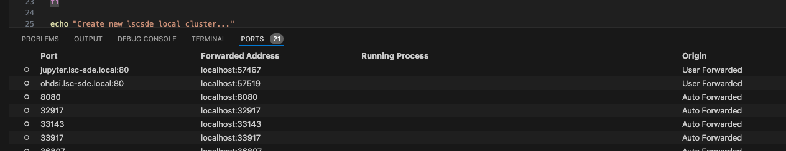

# Devcontainer Guide
The LSC devcontainer provides a consistent and reproducible development environment that removes the need to go through the process of preparing a local development machine with tooling and configuration specific to LSCSDE. In addition, it enables development from GitHub Codespaces as well as a local machine with the use of VS Code and Docker Desktop (see [here](https://code.visualstudio.com/docs/devcontainers/containers) for more details).

### Devcontainer Services
The devcontainer for LSCSDE comprises three containers (see .devcontainer/docker-compose.yaml):
- devcontainer includes a docker instance that follows a docker-in-docker (dind) model for deploying a K8s cluster using K3d. In addition, it includes required lscsde cli tools:
    - Terraform
    - Helm
    - Azure-cli
    - K3d
    - Kubectl
    - FluxCD 2
    - Docker

- Broadsea-atlasdb is a postgres service that prepares the ohdsi database along with synthetic medical data. It is configured with the hostname (cluster.lsc-sde.local) on the same network as the devcontainer so devcontainer containers and internal devcontainer services (i.e. K3d cluster) can connect. This service adds additional users and permissions (i.e. ohdsi@cluster.lsc-sde.local) required by LSCSDE services to access the database. 
- pgAdmin is a helper service that provides a web-based UI to manage the ohdsi database. It is preconfigured to load the ohdsi postgres server. Default pgAdmin user account credentials are:

```
postgres@postgres.com : mypass 
```

The admin UI is accessible on http://localhost:8888. On first load when connecting to the ohdsi/postgres database you may be prompted for the postgres password.

### K8s Local Cluster
The devcontainer creates and provisions a local K8s cluster using K3s - a lightweight Kubernetes distribution for resource-constrained environments (e.g.  IoT/edge devices). K3s optimises for a low memory footprint (similar to microK8s) and runs on various OSs and architectures (i.e. Linux and Windows, arm64/amd64). K3d acts as a utility tool that facilitates the creation of K8s clusters using K3s inside Docker containers. The devcontainer uses K3d to create a lightweight cluster (lscsde) running in a docker-in-docker (dind) container. For more details on K3d see [here](https://k3d.io/v5.6.3/). In addition, kubectl is also made available to manage the local cluster.


## Get Started
To get started with the devcontainer, open VS Code and clone the lsc-sde root repository (https://github.com/lsc-sde/lsc-sde ). For deploying locally, ensure you have Docker Desktop running. Ensure your local machine has a specification to comfortably run the lscsde cluster. We recommend that your local Docker Desktop resource allocation has a minimum:
- 16 Core CPU
- 6GB RAM
- 200GB virtual disk allocation
If your local machine is unable to meet these requirements the LSCSDE cluster can become unstable and result in K8s pod evictions. Therefore, choose to deploy the devcontainer within a Github Codespaces environment from your local VS Code environment (more details [here](https://docs.github.com/en/codespaces/developing-in-a-codespace/using-github-codespaces-in-visual-studio-code)).

### Environmental Settings
Before building and attaching to the devcontainer, you have a small number of default environment variables that can adjusted to your specific needs.
In the .devcontainer/ directory in the root lscsde repository there are two files that can be configured:
- The **.env** file specifies the architecture (e.g.  arch=arm64 or arch=amd64) for building the pgadmin container. This defaults to amd64 but can be changed to arm64 if required.
- The **lsc-local-cluster.sh** performs creation and configuration of the k3d local cluster including the installation and deployment of flux components along with LSCSDE specific cluster services (e.g. calico for networking policies and metallb as the required load balancer). The following variables can be changed to point flux to the preferred git repository for flux. These default to:

```bash
LSCSDE_FLUX_REPO_URL="https://github.com/lsc-sde/iac-flux-lscsde"
LSCSDE_FLUX_REPO_BRANCH="release/<version_here>"
LSCSDE_FLUX_REPO_CLUSTER_PATH="./clusters/devcontainer-local"
```

All variable defaults can be keep and the devcontainer will still build. Although ensure that the correct branch you will develop towards is set e.g. ‘release/0.1.338’ or  ‘hotfix/my-new-feature’.

### Secrets Distributor
Currently, the lscsde requires the developer to make available a ‘secrets’ directory that contains files which include credentials to allow deployed k8s services to authenticate and communicate. The developer must request access to this directory and place it in the directory .devcontainer/k3d-volume once they have pulled the root lsc-side repository to their local machine which must be named “secrets” aka .devcontainer/k3d-volume/secrets. The devcontainer looks for this directory on startup and attempts to mount it into the devcontainer for the secrets-distributor to consume.

### Build & Deploy
To build and run the container open the command palette (Fn + F1 on mac) and type ‘> Dev containers: Rebuild Container’ and Enter to build and run the devcontainer. On the first build, this can take upto 5-10 minutes but once built is much quicker. Monitor the terminal for build logs, once completed you should see a similar output shown below:
{: width="100%"}

At this point the devcontainer environment is up and running with a k3d cluster and flux will begin to reconcile and deploy LSCSDE services and resources. It can take upto 10-15 minutes before the LSCSDE cluster stabilises.

In the meantime, ensure that cluster applications are accessible from the devcontainer. For ohdsi and jupyter services ensure that the /etc/hosts file on the devcontainer instance includes relevant hostname mappings to the loadbalancer IP. To find the loadbalancer IP call:

```bash
kubectl get svc/ingress-nginx-controller -n nginx -o=jsonpath="{.status.loadBalancer.ingress[0].ip}"
```
Then set the hostnames to the IP in etc/hosts e.g. 

```bash
echo '172.19.0.3 jupyter.cluster.lsc-sde.local ohdsi.cluster.lsc-sde.local' >> /etc/hosts
```

To access web services from your host machine browser, go to the ports tab in vs code while the devcontainer is running and add port forwarding for the relevant services e.g.:
{: width="100%"}

Once the devcontainer has been built and deployed you’ll have an isolated development environment with a running K8s cluster named ‘lscsde’ along with all lscsde components.

Run the command below to confirm all services are running:
```bash
kubectl get pods -A
```
The output should look similar to:

{: width="100%"}

This initial version of the devcontainer automates all of the setup instructions outlined [here](./New-Environment.md) and installs all tooling discussed [here](../../Developers.md).

## Devcontainer Restart
On re-connecting to the devcontainer, any previous cluster will be deleted and a clean cluster will be initialised by default.
