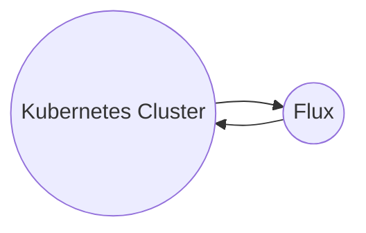

# Creating a New Environment
The following is a step-by-step guide to creating a new environment for the solution.

Unfortunately the solution is somewhat of a chicken and egg situation, certain elements of the IAC need to be updated into the flux configuration, and some elements from the flux configuration needs to be applied to the IAC script. We will try to remove these elements in due course to make it cleaner.

## Flux Configurations
### certmanager
in the /clusters folder create a copy of the **template** folder and rename the new folder to the name of the environment you're creating (e.g. dev)

### github-action-runners
in the /cluster folder create a copy of the **template** folder and rename the new folder to the name of the environment you're creating (e.g. dev). 

Once the IAC has completed you will need to revisit this and edit the newly created:
/cluster/{environment}/secret.yaml

to update the values:
* userAssignedIdentityID - This will be the client_id of the kubelets managed identity
* keyvaultName - This will be the name of the key vault for this environment