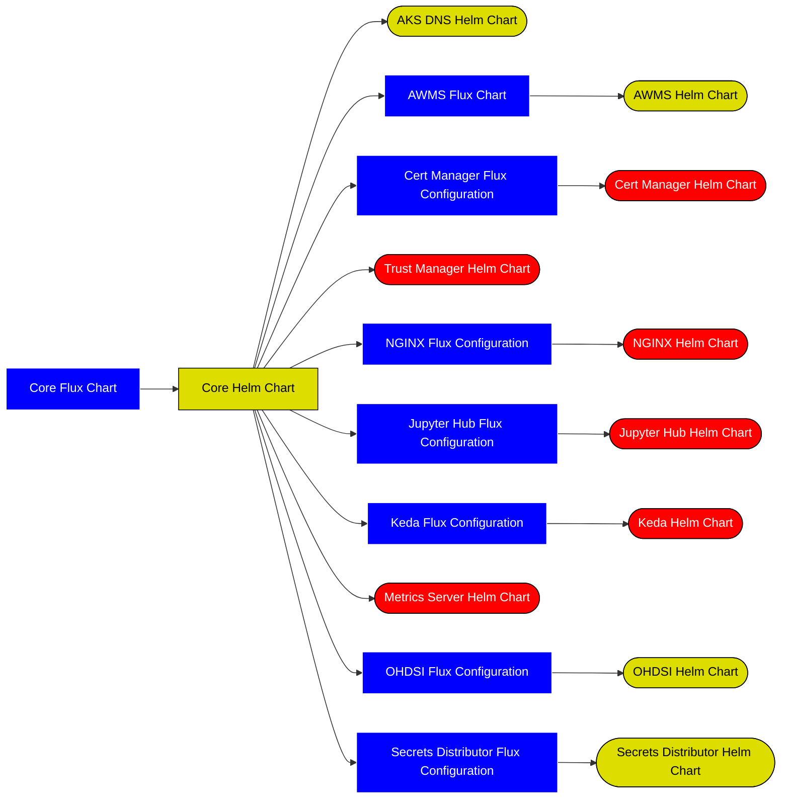

## Infrastructure as Code
IaC for the LSCSDE is split into 3 core types:
* [Helm Charts](./IAC/Helm.md)
* [Flux Charts](./IAC/FluxCD.md)
* [Terraform](./IAC/Terraform.md)

# GitOps Flow
There is a chain of flux and helm charts that work together in order to deploy an environment

