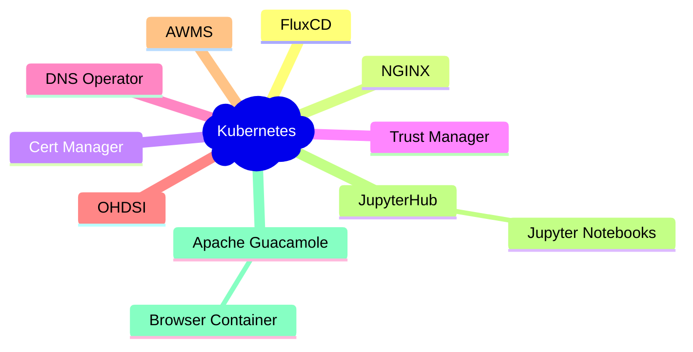

# Kubernetes
[Kubernetes](https://kubernetes.io/), also known as K8s, is an open-source system for automating deployment, scaling, and management of containerized applications.

In the Lancashire and South Cumbria Secure Data Environment Kubernetes makes up the core of our plaform, hosting the vast majority of our solutions. When combined with a cloud provider such as [Microsoft AKS](./Elastic-Compute-Resource/Microsoft-Azure/Azure-Kubernetes-Service.md) it allows us to provide on-demand scalability and leverage the [elasticity of cloud technologies](./Elastic-Compute-Resource.md).

In addition to this the [Analytics Workspace Management Solution](../Components/Analytics-Workspace-Management-Solution.md) leverages [Custom Resource Definitions](./Kubernetes/Custom-Resource-Definitions.md) to allow us to define workspaces and user bindings.