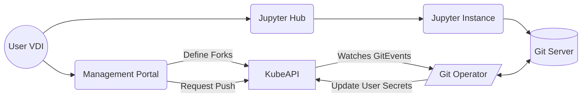

### Git Server
When a workspace is defined, a git server should be implemented that will fork any repositories that are needed for the research project.

This same server can store any source code in its local source control without it being published to the internet. If we then wish to push these changes back to a git repository. An action can be placed to push a predefined github repository once it has been approved, this means that no single person can egress data from the environment to github which acts as checks and balances.

