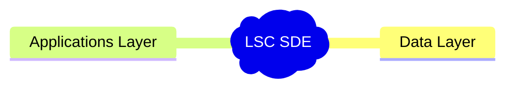
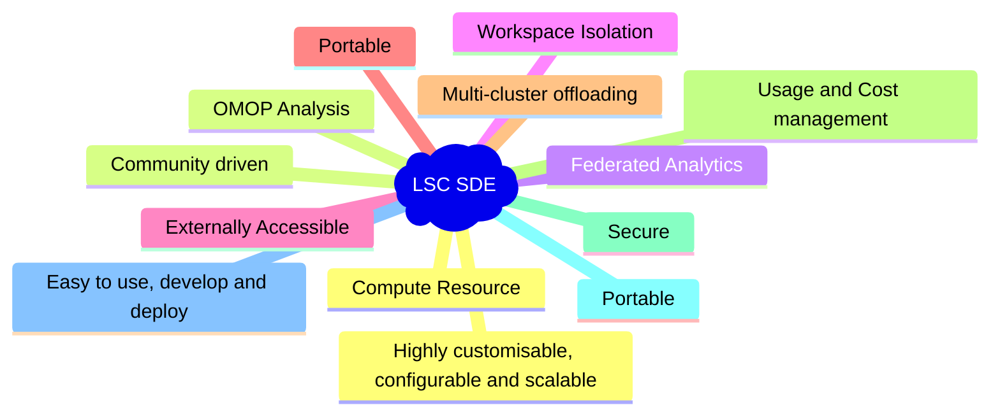

# What is a Secure Data Environment (SDE)
The Lancashire and South Cumbria Secure Data Environment is a secure research analysis platform.

This service gives approved researchers with approved projects secure access to NHS healthcare data. All patient information in the SDE is pseudonymised, which means that any identifying (or personal) information such as names, addresses or NHS numbers are replaced with artificial, or ‘pseudo’, information.

The documentation on this site will largely focus on the application layer of the system

## Data Layer
The solution utilise Databricks (TODO: ADD link to databricks), this provides our datalake and the core data orchestration capabilities to centralise the data for use in the SDE and other projects.

## Application Layer
The application layer provides numerous different capabilities via a number of different applications.

This of course supplements the usual capabilities Data Governance, Cyber Security and Data Management that are outlined in the [SATRE specifications](https://satre-specification.readthedocs.io/).