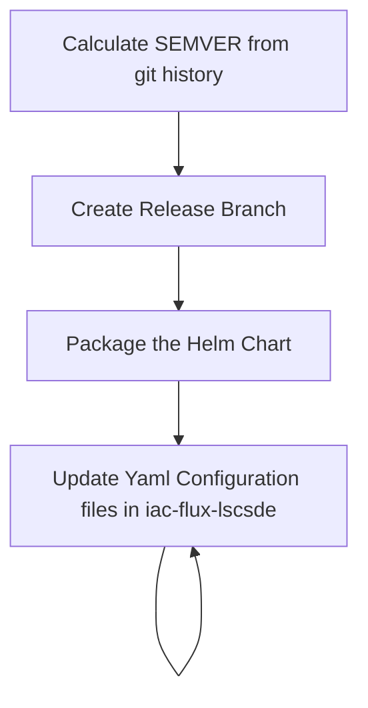

# Core Charts
* [lscsde-flux](./lscsde-flux/)

# Application Charts
* [Analytics Workspace Management](./analytics-workspace-management/)
* [Apache Guacamole](./guacamole/)
* [OHDSI](./ohsdi/)

# Utility Charts
* [AKS DNS Operator](./aks-dns-operator/)
* [Secrets Distributor](./secrets-distributor/)
* [ConfigMap Transformer Controller](./configmap-transformer-controller/) - deprecated
* [github-actions-runner](./github-actions-runner/) - deprecated

# Helm Repository
The above charts are made available by github pages, which is configured against the main branch of this repository

To add this repository to helm use the following commands
```bash
helm repo add lscsde https://lsc-sde.github.io/iac-helm-repository/
helm repo update
```

The core chart to call is lscsde-flux, this will install all of the flux/helm required to setup an environment.

## adding to the repository
There are pipelines on each of the helm repositories which will:


This will in turn trigger the pipeline for [the flux repositories](../flux/)