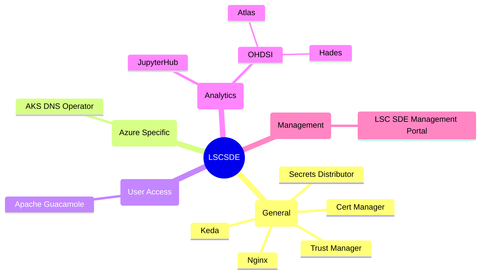

# Components of LSC-SDE

## General Components
* [Secrets Distributor](./Components/Secrets-Distributor.md)
* [Cert Manager](./Components/Cert-Manager.md)
* [Trust Manager](./Components/Trust-Manager.md)
* [Nginx](./Components/Nginx.md)
* [Keda](./Components/Keda.md)
## Management
* [Analytics-Workspace-Management-Solution](./Components/Analytics-Workspace-Management-Solution.md)
## User Access
* [Apache Guacamole](./Components/Apache-Guacamole.md)
## Azure Specific Components
* [AKS DNS Operator](./Components/Azure-Specific/AKS-DNS-Operator.md)
## Analytics
* [Jupyterhub](./Components/Jupyter-Hub.md)
* [OHDSI](./Components/OHDSI.md)