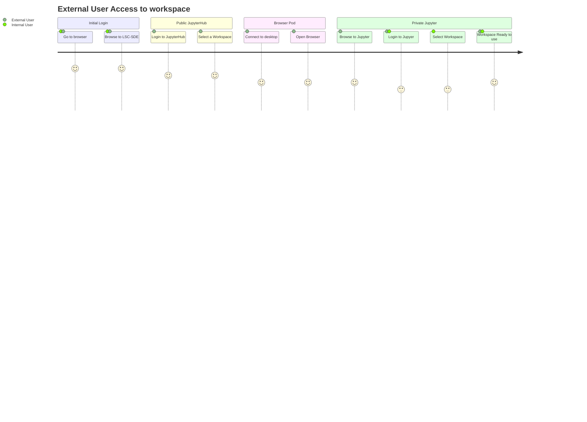
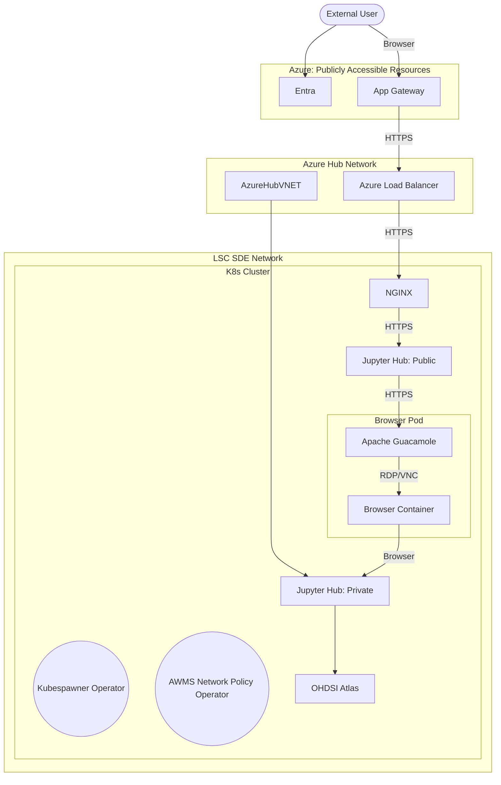
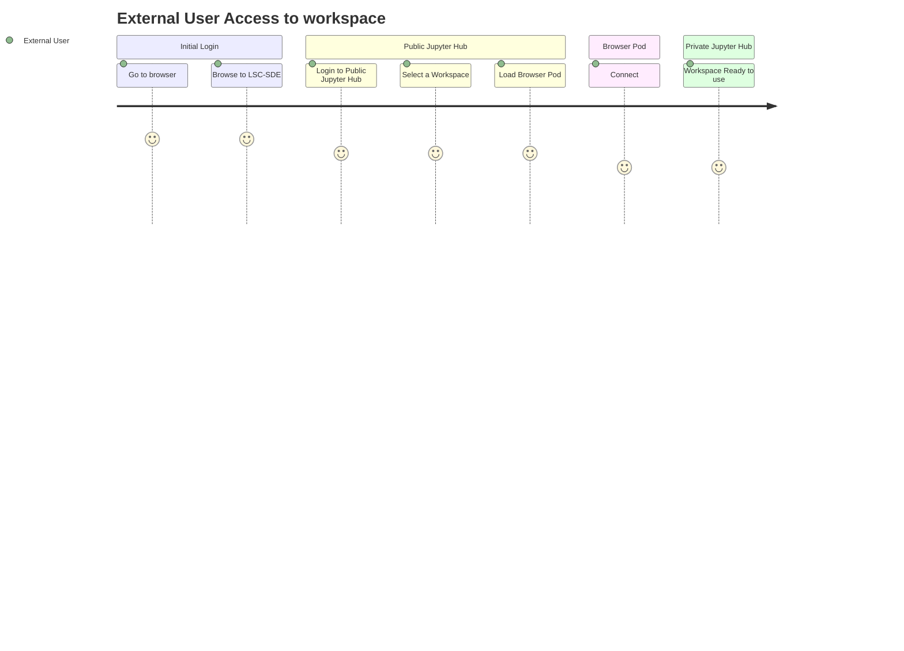

# External Access - Option 6
As many of our research partners are universities and other organisations outside of the NHS it is likely that some of the users will not have a connection into the private network where the LSC SDE is hosted. As a result we need to provide secure access to the platform for external users.

## Requirements
The solution for external access must address the following requirements:
* Provide Secure Access to the environment for researchers
* Address the concerns of the majority of scenarios outlined in discussion #54
* Make the user journey as reasonably simple as possible for the user
* Apply appropriate roles based access controls

Options have been discussed in #55

## User Journey

## Components

### Workflow Components
#### Azure App Gateway Service
The Azure App Gateway service will be used as an application firewall and will expose the nginx service via the Azure Load balancer. This can be swapped out for another app firewall service.

#### Azure Load Balancer
The load balancer will expose the nginx service to the app gateway service. This can be swapped out for another load balancer service

#### [NGINX Ingress](./Components/Nginx.md)
The ingress NGINX service will act as a reverse proxy, forwarding traffic to Apache Guacamole.

#### [Apache Guacamole](./Components/Apache-Guacamole.md)
Apache Guacamole is the first application hit by external users, once logged in via an authentication / authorization service such as Azure Entra ID you are presented with a list of workspaces that you have access to. Once you select a workspace, Apache Guacamole will establish a VNC connection with the browser container provisioned for this user/workspace. From that browser container the user will then be able to access the relevant resources on the environment.  

It is even possible to configure Apache Guacamole to record user sessions so that they can be reviewed later.

We will need to configure the Apache Guacamole operator to use Jupyter Hub's authentication / authorisation.

### Supporting Components
#### Kubespawner Operator
[A proposed change to the way that the current kubespawner works has been proposed](https://github.com/jupyterhub/kubespawner/issues/839) which will use a kubernetes operator approach to provisioning jupyter notebooks. This should ideally be implemented in order to support this workstream. We can then have two separate jupyter hub instances using the same operator and we can use this to provision jupyter notebooks.

#### AWMS Network Policy Operator
The AWMS Network Policy operator will watch for changes in  Analytics Workspaces and create network policies based on the definition of the workspace.

When a workspace is created, a network policy is generated based on the spec for the pods in that workspace.

When a workspace expires or is removed, the operator will detect this and remove the network policies relating to that workspace.

### Products
#### Jupyter Hub
Our custom image of Jupyter Hub will need to be adapted to identify the source of the request, if the user has come from a browser pod then it will only login the user to the workspace associated with that browser pod. 

#### OHDSI Atlas
If we can integrate Atlas into our Jupyter Notebooks then we can expose Atlas via jupyter hub, meaning that the user won't have to login again. 

## Improvements
The current model does not pass down credentials to the host server, so if the user needs access to other resources that are authenticated using Entra ID they will need to login again.

This will simplify the user journey greatly:

There are a number of options on how we can address this, with benefits and drawbacks.

