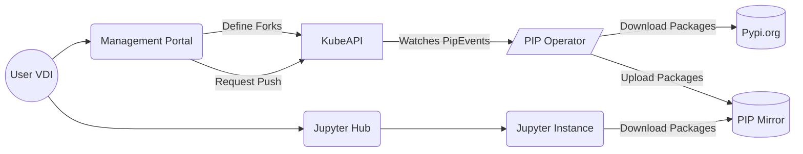

# PyPI Mirror
When a workspace is defined, a pypi mirror should be implemented that will download any defined modules and their dependencies. Jupyter servers will then fetch any dependencies from this mirror rather than pypi.org direct.

